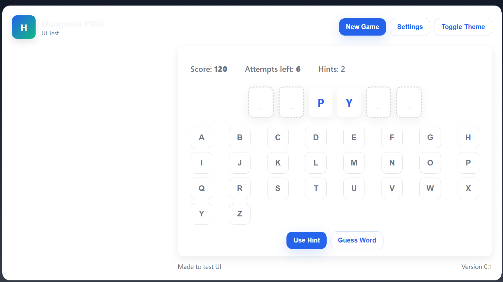
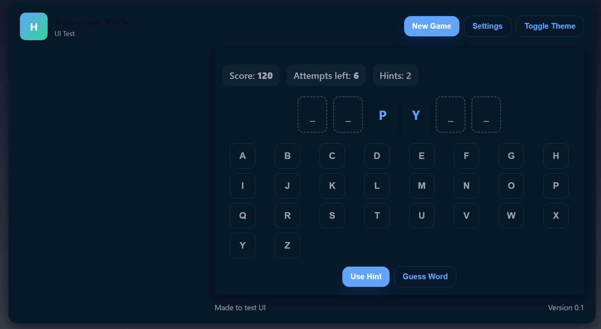

# Software-Development-2-Hangman-Game
This repo is for the mobile Hangman game which is capable of running on mobile phones and tablets.

# Project Hangman:

Project Hangman is a mobile application that brings the classic word-guessing game, Hangman, to your fingertips. Designed for both phones and tablets, this app offers an engaging and interactive experience for users of all ages.
In the game a player is presented with a series of blank spaces representing a hidden word. The player must guess letters one at a time, with each incorrect guess bringing them closer to "hanging" the stick figure. The objective is to reveal the entire word before running out of attempts.

# Team Members:

This project is done solo by one person:
- Alex - Full stack developer / Project Manager / Documenter / quality assurance

## Contribution from Alex

### Activity 1 – Requirements and Creative Session
1. Created overall specification based on user and system requirements
2. Determined the project’s high-level ‘functional specifications’
3. Identified and established software development strategy
4. Created an overall test strategy for the project to include both manual and automated testing approaches plus performance testing of the frontend

### Activity 2 - Design Analysis Session

1. Created the initial specifications from Activity 1 to ensure the project scope is achievable within the time constraints and split the scope into MVP and nice-to-have Phase 2 features.
2. Created the overall architecture design for the hangman game application to be comprised from backend and frontend parts communicating via REST API and enabling multiple players to play the game from mobile and tablet devices.
3. Created the definition of game state management, game logic and scoring system designs for the hangman game application.
4. Defined the core gameplay features such as new game, letters guessing, gallows rendering, hints usage etc.
5. Identified the key technical must-haves such as user authentication, random word selection based on difficulty level, REST API endpoints, serialisation/de-serialisation of games, persistent storage of user data, words list and in-progress games into database to store state and allow players to continue games where thet left them.
6. Generated the vocabulary of 365 words with clues split by difficulty levels to be used in the random word generation algorithm.

### Activity 3 - Coding

1. Implemented the backend part of the hangman game application using FastAPI Python framework, including backend app startup sequence, user authentication, game logic, scoring system and all REST API endpoints
2. Developed all backend components including data models (models folder), schemas (schemas folder), REST API endpoints (routers folder), CRUD operations (crud folder), database connection and persistent storage (database folder) and main app startup (main.py)
3. Developed game state management logic to track current score, hints made, attempts left etc.
4. Implemented core gameplay features in the backend such as starting a new game, guessing a letter, using hints, changing score and revealing correctly guessed letters.
5. Implemented the game over and game win logic to determine when the game ends.
6. Implemented scoring system where points are awarded for correctly guessed letters and penalties are applied for hints being used.
7. Created error handling mechanisms to handle invalid inputs, unauthenticated attempts to hit endpoints and either throw exceptions or return proper errors back to frontend e.g. attempt to guess a letter in a finished game returns 409 Conflict error.
8. Fully documented the codebase with comments and docstrings to ensure maintainability and ease of understanding for future developers.
9. Implemented user authentication system allowing players to create accounts, log in and have their scores and progress saved into the database.
10. Developed the frontend part of the hangman game application using Progressive Web App (PWA) technology to ensure mobile and tablet compatibility.
11. Created all frontend components including HTML structure (HTML files), CSS styling (CSS files) and JavaScript logic (JavaScript files) to provide an interactive user interface for the hangman game application.
12. Implemented responsive design principles to ensure the frontend works seamlessly on various screen sizes and devices.
13. Developed user interface elements such as main menu, game screen, score display, letter input system and feedback indicators.
14. Integrated the frontend with the backend REST API endpoints to enable communication between the two parts of the hangman game application.
15. Implemented client-side validation and error handling to provide immediate feedback to users for invalid inputs or actions.
16. Fully documented the frontend codebase with comments to ensure maintainability and ease of understanding for future developers.

### Activity 4 - Testing

1. Created a set of automated tests (tests folder) to test the backend part of the hangman game application for REST API endpoints covering main requests and error handling
2. Executed the automated tests to verify the correctness of the backend part of the hangman game application to ensure all REST API endpoints work as expected together with error handling and edge cases
3. Fixed bugs found during automated testing of the backend part of the hangman game application
4. Fixed bugs found during manual testing of the frontend part of the hangman game application
6. Documented the test results of the automated tests performed on the backend part of the hangman game application
7. Created a comprehensive manual testing plan for the frontend part of the hangman game application covering all key user interactions and scenarios
8. Executed the manual testing plan to verify the correctness of the frontend part of the hangman game application to ensure all user interactions and scenarios work as expected
9. Documented the test results of the manual tests performed on the frontend part of the hangman game application

### Activity 5 – Activity Group Guidance – Project Design, Development, Deployment (Part A)

1. Gathered and documented evidence from all of the project’s activities and outcomes
2. Produced many screenshots and code snippets to illustrate the key parts of the project
3. Contributed all of the content into the README.md file to document the project comprehensively
4. Produced a cited review of the development strategy used to include advantages and disadvantages
5. Produced References section citing all external sources used during the project
6. Contributed to an evaluation of how well the project met each of the requirements together with a statement of the project’s overall success

# Activity 1 – Requirements and Creative Session

I've decided to re-arrange the tasks stated in the assignment brief for the Activity 1 in a more logical order to make it easier to work on them.

## Task 1 – Review all available projects before deciding which to develop

Project: Hangman
Description: Multiple players can engage in a simple, GUI-based game of Hangman.

Project: Hide and Seek 
Description: Multiple players can hide items (or their avatar) in a scene while another player will try to find them (seek).

Project: Chat App
Description: Multiple users can send simple, text messages to each other.

I've reviewed all 3 available projects to chose from and having carried out some research, I've decided to go with the Hangman game project.
I felt that the Hangman game would be a good fit for my project as it combines word guessing with a simple yet engaging gameplay mechanic.
The game is easy to understand and can be enjoyed by players of all ages, making it a versatile choice.
Additionally, the Hangman game allows for the implementation of various features such as scoring, hints, and difficulty levels, which can enhance the overall user experience.

## Task 2 – Primary Target Audience

During the research, I've decided that my Hangman game targets **school kids aged 7–15**, mainly small kids who are just learning to read and spell and are learning vocabulary, as well as teenagers who enjoy word games and puzzles.
They are likely to play the game on mobile devices such as smartphones and tablets, either during breaks at school or at home.
This choice is based on the fact that Hangman is a classic word game that can help improve vocabulary and spelling skills, making it suitable for educational purposes as well as entertainment.

## Task 4 – User Profiles

I've created two user profiles representing my primary target audience:

### 👩‍💼 Olivia (9)
- Primary school student
- Plays hangman games to improve spelling and vocabulary.
- **Wants:** simple, fun puzzles with visual appeal.
- **Needs:** Intuitive interface, hints for difficult words.
- **Frustrations:** Overly complex rules or cluttered screens.

### 👨‍💻 Nathan (13)
- Secondary school student
- Enjoys word games during breaks.
- **Wants:** Challenging words and various difficulty levels.
- **Needs:** Smooth gameplay and clear feedback.
- **Frustrations:** Laggy performance or lack of variety in words.

## Task 5 - High level user requirements

### High level user requirements

Based on my target audience and user profiles, I've developed the following preliminary high-level user requirements for my **Hangman game**.
Depending on available time, some of these may be deprioritised to ensure I am capable of meeting the assignment deadline. 
The strict timeline means I must first focus on the **core gameplay features**, polish those, and only then add additional features.
I’ve therefore identified the **core (MVP)** features and **nice-to-have (Phase 2)** features.

---

## MVP Features (Must Have)

1. **Main page**  
   The game must have a main page (index.html) with the game description, game logo and buttons to create an account or log in.

2. **Main game page**  
   The game must have a main game page with options to start a new game, main game layout and game controls.

3. **Game Win Screen**  
   Displayed when the player successfully guesses the full word before running out of attempts.  

3. **Game Over Screen**  
   Displayed when the player runs out of allowed attempts.  

4. **New Game Functionality**  
   Player must be able to start a new Hangman game at any time.  

5. **Random Word Selection**  
   Each new Hangman round uses a random word from a wide range of topics (e.g., animals, countries, movies).  

6. **Scoring System**  
   Players earn points for correctly guessing letters or completing a word. 
   Players lose points for using hints.

7. **Heads-Up Display (HUD)**  
   The HUD should display current score, word progress (revealed/hidden letters), remaining attempts, hints used.  

8. **Word Display**  
   The word must be shown as a series of blanks (“_”) that get filled as the player guesses correctly.  

9. **Letter Input System**  
   Player must be able to input a letter guess through on-screen letter buttons.  

10. **Feedback on Guesses**  
   The game must give immediate feedback for each guessed letter (correct or incorrect).
    If a player correctly guesses a letter, it should be revealed in the word display.
    If the guess is incorrect, the gallows graphic should progress to the next stage.

11. **Hint Feature**  
   Player can use a limited number of hints to reveal a letter, but each hint deducts points.  

12. **Full Word Guess Option**  
   Player can attempt to guess the entire word at once. An incorrect full-word guess applies a large penalty or counts as multiple missed guesses.
   **(Note: Descoped from Phase 1 and move to Phase 2)**

13. **User Accounts and Login**  
   Players must be able to create an account and log in so that scores and progress can be saved.  

14. **Intuitive User Interface**  
   The game must have a clear and easy-to-navigate interface for menus, gameplay, and viewing stats.  

16. **Dynamic Word Generation**  
   The game should draw words dynamically from a curated dictionary.  

---

## Nice-to-Have Features (Phase 2)

1. **Difficulty Levels**  
   Player can select from *Easy*, *Medium*, or *Hard* modes, which change word length, allowed attempts, or topic difficulty.  
   **(Note: Completed in Phase 1)**  

2. **Advanced Scoring Logic**  
   Bonus points for streaks (e.g., multiple correct guesses in a row) or for finishing with remaining attempts.  

3. **Accessibility Features**  
   High-contrast color schemes, large font options, and full keyboard navigation.
    **(Note: Completed in Phase 1)**

4. **Leaderboard**  
   Display the top 10 players along with their scores and completion times.  

5. **Game Timer**  
   Timer to measure how long the player takes to finish each word.  

6. **Timer Toggle Option**  
   Player can choose to enable or disable the game timer.  

7. **Responsive Design**  
   The game should adapt seamlessly to different screen sizes and devices (desktop, tablet, mobile).
    **(Note: Completed in Phase 1)**

8. **Progress Saving**  
   Player’s progress and scores should be saved locally or online to allow them to resume unfinished games.  
   **(Note: Completed in Phase 1)** 

9. **Sound Effects and Music**  
   Background music and sound effects for correct/incorrect guesses, game win/loss, etc.

10. **Light and Dark Themes**  
    Player can switch between light and dark visual themes for better visibility in different lighting conditions.  
    **(Note: Completed in Phase 1)**

---

## Hardware Requirements

Players of the Hangman game will need a device capable of running a web browser—such as a desktop computer, laptop, tablet, or smartphone.  
The device should have at least **2GB RAM** and a **modern processor** for smooth gameplay. No dedicated GPU is required, as the game is not graphically intensive.

---

## Operating System Requirements

The Hangman game is meant to be **mobile-ready** as per the requirements and compatible with operating systems such as:  
- **iOS**  
- **Android**

---

## Key Application Functions

| Functionality              | Description                                                                                                                                 |
|----------------------------|---------------------------------------------------------------------------------------------------------------------------------------------|
| **User Authentication**    | Players can create accounts and log in to save scores and progress.                                                                         |
| **Game Interface**         | Intuitive UI for navigating menus, starting games, and viewing scores.                                                                      |
| **Gameplay Mechanics**     | Core Hangman mechanics: guessing letters, revealing words, tracking attempts, and scoring.                                                  |
| **Game state Management**   | Tracks current score, word progress, remaining attempts, and hints used.                                                                     |
| **Dynamic Word Selection** | Randomly selects words from a curated dictionary for each new game.                                                                        |
| **Feedback System**        | Immediate feedback on guesses, score updates, and game status (win/loss).                                                                |
| **Hint System**            | Allows players to use hints to reveal letters at a score penalty.                                                                          |
| **Responsive Design**      | Adapts to various screen sizes and devices for optimal user experience.                                                                    |
| **Game HUD**            | Displays current score, word progress, remaining attempts, and hints used.                                                                  |
| **Accessibility Options**   | High-contrast modes, large fonts, and keyboard navigation for inclusivity.                                                                 |

### AI in the game

In my game, I am not planning to use AI features as part of the core gameplay experience.
The only kind of 'AI' feature I am going to use is using an algorithm to randomly select a word for a new game started by a user using the vocabulary of words with topic, clue and difficulty level.
For this I am going to use a predefined list of words and the algorithm would randomly select word from this list for each game session played by a user.
So, this is going to be a basic implementation and does not involve advanced AI techniques.

---

## Task 3 - Create an overall specification 

Create an overall specification based on user and system requirements (including HCI, game/application-rules and the 
game/application-mechanics (e.g. what are the rules for the game, how will the game be controlled, how will 
any non-player characters interact, etc.) 

The following list of functional requirements has been produced to cover the high-level user requirements from task 5 above.
It has to be mentioned the list also has the acceptance criteria for each functional requirement to ensure that the requirement is testable and verifiable.

| Functional requirement             | Type | Specification                                                                                                                                                         | Acceptance Criteria                                                                                                                                                                                                                                                                                                                            |
|------------------------------------|------|-----------------------------------------------------------------------------------------------------------------------------------------------------------------------|------------------------------------------------------------------------------------------------------------------------------------------------------------------------------------------------------------------------------------------------------------------------------------------------------------------------------------------------|
| Main page when app starts          | UI   | The main page is displayed with game description, game logo, game rules and buttons to log in or create an account.                                                   | When the app starts, main page is displayed with game description, game logo, game rules and buttons to log in or create an account.                                                                                                                                                                                                           |
| Game win screen when the user wins | UI   | When a player correctly guesses full word, a Game Win screen is displayed.                                                                                            | When whol word is guessed correctly, the Game Win screen appears.                                                                                                                                                                                                                                                                              |
| Game over screen when user loses   | UI   | When a player runs out of allowed guess attempts, a Game Over screen is displayed.                                                                                    | When the player runs out of allowed guess attempts, the Game Over screen appears.                                                                                                                                                                                                                                                              |
| Start new game                     | UX   | Player can start a new game from the main game layout.                                                                                                                | When user clicks "Start New Game" button on the main game layout, a new game is started with a new random word and game state is reset.                                                                                                                                                                      |
| Random word for a new game         | Sys  | The game uses a set of words from different topics to select a random one for a new game started by a user.                                                           | When a new game is started, a random word is selected from the predefined list of words with topics, clues and difficulty levels.                                                                                                                                                                                                              |
| Scoring system                     | Sys  | Player scores points when correct letter is guessed. The number of points scored equals to 10.                                                                        | When player guesses a letter correctly, score is increased by 10 points. Example: guess letter is 'A' and it exists in the word so player's score is increased by 10 points.                                                                                                                                                                   |
| Scoring system                     | Sys  | Player scores penalty points when using a hint. The number of points subtracted equals to 10.                                                                         | When player uses a hint to reveal a letter, score is decreased by 10 points. Example: user uses a hint so player's total score for the game is reduced by 10 points.                                                                                                                                                                          |
| HUD display                        | UI   | HUD shows current game state details like current score, attempts left, hints used.                                                                                   | During gameplay, HUD displays current score, attempts left and hints used.                                                                                                                                                                                                                                                                     |
| Gameboard rendering                | UI   | Gameboard is rendered on screen with a word hidden and empty boxes shown for each letter plus alphabet is rendered and empty space where gallows is to be rendered.              | During gameplay, gameboard is displayed with hidden word represented as empty boxes, alphabet letters for guessing and gallows area.                                                                                                                                                                                                          |
| Responsive design                  | UI   | The game is optimized for various screen sizes and devices.                                                                                                           | The game layout adjusts correctly on desktop, tablet, and mobile devices without loss of functionality.                                                                                                                                                                                                                                        |
| User management                    | Sys  | Player can create an account so that their scores and progress can be saved.                                                                                          | Players can register with a username and password and optional email address.                                                                                                                                                                                                                                                                  |
| User management                    | Sys  | Player can log in to the game so that their scores and progress can be saved.                                                                                         | Players log in with their previously registered username and password.                                                                                                                                                                                                                                                                         |
| Letter input system               | UX   | Player can input a letter guess through on-screen letter buttons.                                                                                                    | When player clicks on a letter button, the letter is registered as a guess for the current game.                                                                                                                                                                                                                                             |
| Feedback on guesses               | UX   | The game gives immediate feedback for each guessed letter (correct or incorrect). If correct, letter is revealed in the word display. If incorrect, gallows graphic progresses. | When player guesses a letter, if correct, the letter is revealed in the word display; if incorrect, the gallows graphic progresses to the next stage.                                                                                                                                                                                        |
| Use hint                          | UX   | Player can use a limited number of hints to reveal a letter, but each hint deducts points.                                                                           | When player clicks "Use Hint" button, a letter is revealed in the word display and player's score is decreased by 10 points.                                                                                                                                                                                                                  |

---

## Task 6 – Non-Functional Specifications

It is important to consider non-functional specifications as part of the overall specification for the Hangman game.
I've identified the following non-functional specifications to be important for my Hangman game:

| Category            | Specification                                                          |
|---------------------|------------------------------------------------------------------------|
| **Usability**       | Simple controls and clear instructions.                                |
| **Responsiveness**  | Works perfectly on desktop, tablet, and mobile.                        |
| **Aesthetic**       | Clean game layout, minimal colours, modern typography.                 |
| **Performance**     | Loads under 3 seconds, no noticeable lag.                              |
| **Reliability**     | Auto-saves progress in the backend.                                    |
| **Maintainability** | Code modular and well-commented and well-documented for easy updates.  |
| **Scalability**     | Backend can handle multiple concurrent users without performance drop. |
| **Accessibility**   | High-contrast mode, large fonts, keyboard navigation.                  |
| **Security**        | Secure user authentication and data storage e.g. hashed passwords.     |
| **Multi-device**   | Syncs progress across devices when logged in.                           |

---

## Task 9 - Identify and rank potential risks to the project’s success 

I've identified the following potential risks to the project's success along with their mitigation strategies:

| Category                           | Description                                                                                                        | Mitigtion Strategy                                                                                                                                             |
|------------------------------------|--------------------------------------------------------------------------------------------------------------------|----------------------------------------------------------------------------------------------------------------------------------------------------------------|
| Lack of Knowledge About frameworks | When dealing with new Python frameworks I may not know all of their core features and functionalities well enough. | Allocate time for learning and experimenting with the frameworks before starting development to build familiarity and confidence.                              |
| Scope creep                        | The project may become too big to handle to be done solo if I keep adding more and more features to the scope.     | The scope should be frozen to MVP features only to ensure it can be delievered by the deadline and later additional features can be added if the time permits. |
| Time management                    | I may underestimate the time required to complete certain tasks leading to delays.                                 | Create a detailed project plan with realistic time estimates and buffer time for unexpected delays.                                                          |
| Technical challenges               | Unforeseen technical issues may arise during development.                                                          | Conduct thorough research and planning before implementation to identify potential challenges and solutions.                                                  |

---

## Task 10 - Software development strategy 

I've compared three software development strategies Waterfall, Agile and Rapid Application Development (RAD) as the main three candidates to select from as a software development strategy for my Hangman game app.
I've used the following sources [8] and [9] stated in the References section to help me with the comparison of the three strategies.

### Comparison of the three strategies

Overall the three software development strategies can be summarised and compared as follows:

| Criteria                 | Waterfall                        | Agile                               | Rapid Application Development (RAD)   |
|--------------------------|----------------------------------|-------------------------------------|---------------------------------------|
| Flexibility              | Low - rigid phases               | High - iterative and adaptive       | High - iterative protyping            |
| Speed of Delivery        | Slow - sequential phases         | Fast - frequent releases            | Very Fast - rapid prototyping         |
| User Involvement         | Low - mainly at start and end    | High - continuous feedback          | Very High - constant user feedback    |
| Documentation            | Extensive upfront documentation  | Minimal - just enough               | Minimal - focus on working prototypes |
| Risk Management          | High risk if requirements change | Low risk through constant feedback  | Low risk due to adaptability          |  
| Team Size Suitability    | Large teams                      | Small to medium teams               | Small teams                           |
| Project Size Suitability | Large projects                   | Medium projects                     | Small projects                        |
| Outcome Focus            | Deliver complete product at end  | Deliver working software frequently | Deliver working prototypes quickly    |

### Advantages and Disadvantages of Waterfall

**Advantages:**
1. Clear Structure: Waterfall provides a clear and structured approach to development with defined phases.
2. Documentation: Extensive documentation is created upfront, which can be useful for future reference.
3. Predictability: The sequential nature of Waterfall allows for better predictability in terms of timelines and deliverables.
4. Easy to Manage: The linear approach makes it easier to manage and track progress.
5. Well-suited for Stable Requirements: Waterfall works well when requirements are well-defined and unlikely to change.

**Disadvantages:**
1. Inflexibility: Waterfall is rigid and does not easily accommodate changes once a phase is completed.
2. Delayed Testing: Testing is done at the end, which can lead to late discovery of issues.
3. User Involvement: Limited user involvement during development can lead to a final product that does not meet user needs.
4. Risk of Failure: If requirements change, the project may fail or require significant rework.
5. Not Suitable for Complex Projects: Waterfall may not be effective for complex projects with evolving requirements.

### Advantages and Disadvantages of Agile

**Advantages:**
1. Flexibility: Agile is highly adaptable to changes in requirements throughout the development process.
2. Frequent Deliveries: Agile allows for frequent releases of working software, providing value to users early and often.
3. User Involvement: Agile emphasizes continuous user feedback, ensuring the final product meets user needs.
4. Risk Reduction: The iterative approach reduces the risk of project failure due to changing requirements.
5. Collaboration: Agile promotes collaboration among team members and stakeholders.

**Disadvantages:**
1. Less Documentation: Agile often has less upfront documentation compared to Waterfall, which can lead to challenges in maintenance and future development.
2. Resource Intensive: Agile can require significant resources such as skilled developers and active user involvement.
3. Scope Creep: The flexibility of Agile can lead to scope creep if not managed properly.
4. Not Suitable for Large Projects: In its original form Agile is typically better suited for small to medium-sized projects but for large projects it may require scaling frameworks.
5. Requires Skilled Team: Agile requires a team with strong skills and experience to effectively manage the iterative process.

### Advantages and Disadvantages of RAD

**Advantages:**
1. Speed: RAD allows for rapid development and quick turnaround times, making it ideal for projects with tight deadlines.
2. Flexibility: The iterative nature of RAD allows for changes and adjustments based on user feedback throughout the development process.
3. User Involvement: similar to Agile RAD emphasizes constant user feedback, ensuring that the final product meets user needs and expectations.
4. Reduced Risk: The ability to adapt and pivot based on feedback reduces the risk of project failure due to changing requirements.
5. Focus on Prototyping: RAD focuses on creating working prototypes quickly, allowing for early testing and validation of ideas.

**Disadvantages:**
1. Limited Documentation: similar to Agile RAD often results in minimal documentation, which can lead to challenges in maintenance and future development.
2. Resource Intensive: like this is the case with Agile RAD can require significant resources in terms of a team of senior developers and increased user involvement, which may not be feasible for all projects.
3. Scope Creep: The flexibility of RAD can also lead to scope creep if not managed properly, as users may continuously request changes and additions.
4. Not Suitable for Large Projects: RAD is typically better suited for small to medium-sized projects, and may not be effective for large, complex projects.
5. Requires Skilled Team: similar to Agile RAD requires a team with strong skills and experience to manage the rapid development process.

### Reasons for choosing RAD for my project

My thought process for choosing RAD as the software development strategy for my Hangman game project is as follows.
I've rejected the Waterfall strategy because of its rigidity and inflexibility to changes which is not suitable for my project as I expect many smaller and bigger changes to happen during the development based on user feedback.
I also rejected Agile because although it is flexible and adaptive, it may not provide the speed of delivery that I need for my project given the tight deadline. I also don't plan having many iterations and releases but rather focus on rapid prototyping and getting user feedback on those prototypes therefore many of the Agile advantages are not that relevant for my project.
After checking the advantages and disadvantages of all three strategies, I've decided that RAD is the best fit for my project because it offers the speed of delivery and flexibility that I need to meet the project deadline while also allowing for constant user feedback and iteration.

Several particular reasons contributed to my decision in favour of RAD are outlined below:
1. My game project requires speed of delivery and flexibility which RAD perfectly provides.
2. I expected minimum of upfront planning so waterfall with its rigid planning and significant planning overhead wouldn't work.
3. Time sensitivity - as the delivery has to happen in about one month time the turnaround should be really fast to deliver the project as per the defined scope meeting the deadline.
4. Process-wise - I aim to hit the ground running by prototyping features, testing them by users, getting feedback and iterating fast.
5. Documentation-wise - RAD allows me to focus on working prototypes first and document them later when things settle down.
6. With RAD the identified project risks are reduced through the constant user feedback so that pivoting can happen after each prototype say some new UX features to be added like dark vs light theme switching. 
7. RAD works great for small teams and because I am doing the project solo RAD fits very well for this kind of one-man-orchestra setup.
8. RAD is good for small projects and my project is small in scope and also has to happen within a short span of time.
9. Outcome focus: deliver working prototype quickly and then iterate fast to implement all MVP features so that the game crystalises into its final version and become ready for the final submission.

---

## Task 11 - Overall Test Plan

### Overall test strategy

The overall test strategy for the Hangman game involves a combination of manual testing and automated unit tests to ensure the game functions correctly and meets user requirements.
Such combination of manual functional testing and unit tests covering the code allows to achieve high quality of the software being developed such as our crossword game.
The manual testing will focus on the user interface, game state logic, and overall user experience to ensure that the game behaves as expected from a player's perspective.
The unit tests will focus on the backend logic, including REST API endpoints, game mechanics, and scoring to ensure that the core functionality of the game is robust and reliable.

#### Manual Testing

Manual tests are going to be done on the frontend to test the user interface, game state logic like scoring, game over and overall user experience.
For the manual testing a range of test cases will be created to cover all the main user flows and edge cases. 
For frontend part the Dev Tools in the browser will be used to inspect the game state, network calls and console logs to verify the correctness of the game behaviour.

The manual tests will cover the following areas:
1. Game start and main game layout.
2. Hidden word rendering and letter input.
3. Letter guessing and validation.
4. Scoring system and HUD updates.
5. Hint functionality.
6. Game win and game over screens.
7. User account creation and login.
8. Resume game feature when a user logs off and logins back again.
9. Resume game feature when the browser is refreshed or when user log ins from another device.
10. Responsive design on different screen sizes and devices.

The detailed manual test cases will be documented as part of the Activity 4 below.

#### Unit Tests

Unit tests are to be done on the backend to test the REST API endpoints, game logic, scoring etc.
pytest framework can be used for unit testing of the backend part.

#### Performance Testing

Given the scope and nature of the Hangman game, performance testing is not a primary focus.
However, basic performance checks will be conducted to ensure that the game loads quickly and responds promptly to user actions.
To achieve this, tools like Lighthouse part of the browser's Dev Tools can be used to measure page load times and responsiveness.

#### Accessibility Testing

Accessibility testing will be performed to ensure that the game is usable by players with disabilities.
This includes testing for keyboard navigation and color contrast.

---

# Activity 3 – Coding

## Code Repository

The code for this project is hosted on GitHub at:
https://github.com/Alex-Oma/Software-Development-2-Hangman-Game

## Git Branching Strategy

I've decied to go with the following branch strategy on GitHub:
- `main` branch: Stable production-ready code.
- `new_stuff` branch: Development branch for new features and experiments.
- Feature branches: Created from `new_stuff` for specific features or bug fixes, then merged back into `new_stuff` after review and testing.
- Merging `new_stuff` into `main` only after thorough testing and validation to ensure stability.
- Regular commits and pull requests to maintain code quality.

## Developer notes — Backend (FastAPI) + PWA skeleton
To start with, I've created a simple FastAPI backend with a minimal PWA front-end skeleton. 

Running the backend on Windows:

1. Create a virtual environment:

   python -m venv .venv
   .venv\Scripts\activate

2. Install dependencies:

   python -m pip install -r requirements.txt

3. Run the app locally with uvicorn:

   python -m uvicorn backend.app.main:app --reload --port 8000

4. Open the PWA in the browser:

   http://127.0.0.1:8000/index.html

PowerShell helper: `run_local.ps1` is provided which runs uvicorn for convenience.

Unit tests can be run with:
python -m pytest -q

# Activity 4 – Testing

## Testing Strategy

For frontend testing, I've adopted a combination of manual and automated testing strategies to ensure comprehensive coverage of the application's functionality and user experience.
For manual testing, I've focused on exploratory testing to identify any usability issues or unexpected behaviors that automated tests might miss.
This involves navigating through the application, interacting with various UI elements, and verifying that the application behaves as expected.
For automated testing, I am going to implement unit tests for individual components using a testing framework Jest.
These tests focus on verifying the functionality of specific components, ensuring that they render correctly and handle user interactions as intended.
Additionally, I will try setting up end-to-end (E2E) tests using a tool called Cypress to simulate real user scenarios and validate the overall workflow of the application from start to finish.
This includes testing critical paths such as user login, gameplay interactions, and score tracking.

For the backend testing, I've utilized pytest to create unit tests for the FastAPI endpoints.

This way, I can ensure that both the frontend and backend components of the application are thoroughly tested, providing confidence in the application's reliability and user experience.

## Frontend Testing

### Manual Testing Plan and Test Cases with Results

Provided below is the manual testing plan and test cases for the frontend of the Hangman game and their results:

| Test Case ID | Test Description                                                                                          | Expected result                                                                                                                                                                                                                                                                                                                                                                   | Actual result                                                                                                                                                                                                                                                                                                                     | Evidence               | Passed? |
|------------|-----------------------------------------------------------------------------------------------------------|-----------------------------------------------------------------------------------------------------------------------------------------------------------------------------------------------------------------------------------------------------------------------------------------------------------------------------------------------------------------------------------|-----------------------------------------------------------------------------------------------------------------------------------------------------------------------------------------------------------------------------------------------------------------------------------------------------------------------------------|------------------------|---------|
| TC001      | Theme button to switch from light theme to dark theme.                                                    | When the button is clicked, the page is  expected to switch from light theme to dark theme.                                                                                                                                                                                                                                                                                       | When the button is clicked, the page switches from light theme to dark theme.                                                                                                                                                                                                                                                     | 1.png                  | Yes     |
| TC002      | Theme button to switch from dark theme to light theme.                                                    | When the button is clicked, the page is expected to switch from dark theme to light theme.                                                                                                                                                                                                                                                                                        | When the button is clicked, the page switches from dark theme to light theme.                                                                                                                                                                                                                                                     | 2.png                  | Yes     | 
| TC003      | Attempt to click “Create Account” with empty fields.                                                      | When attempted, a message should appear underneath the Username field and the message should say “Please fill in this field”.                                                                                                                                                                                                                                                     | When attempted, a message appears underneath the Username field and the message says “Please fill in this field”.                                                                                                                                                                                                                 | 3.png                  | Yes     |
| TC004      | Navigating to home page by clicking “Home” button.                                                        | When the “Home” button is clicked, the app should navigate to the home page and display the home page to the user.                                                                                                                                                                                                                                                                | When the “Home” button is clicked, the app navigates to the home page and displays the home page to the user.                                                                                                                                                                                                                     | 4.png                  | Yes     |
| TC005      | Navigating back to home page from Registration page by clicking “Cancel” button.                          | When the “Cancel” button is clicked. The app should navigate back to the home page from the registration page.                                                                                                                                                                                                                                                                    | When the “Cancel” button is clicked. The app navigates back to the home page from the registration page.                                                                                                                                                                                                                          | 4.png, 5.png           | Yes     |
| TC006      | Attempt to create account with invalid email format.                                                      | The user fills in the details but enters email in invalid format and the user should get an error message saying “Please include an ‘@’ in the email address.”.                                                                                                                                                                                                                   | The user fills in the details but enters email in invalid format and the user gets an error message saying “Please include an ‘@’ in the email address.”.                                                                                                                                                                         | 6.png                  | Yes     |
| TC007      | Creating account with valid credentials                                                                   | When the user enters all the valid credentials, it is expected that they will be transferred onto the game description page.                                                                                                                                                                                                                                                      | When the user enters all the valid credentials, they are transferred onto the game description page.                                                                                                                                                                                                                              | 7.png                  | Yes     |
| TC008      | Attempt to create account with already existing username                                                  | When the user enters the credentials of an already existing account, they are supposed to get the error message “Username already exists”                                                                                                                                                                                                                                         | When the user enters the credentials of an already existing account, they get the error message “Username already exists”.                                                                                                                                                                                                        | 9.png                  | Yes     |
| TC009      | Attempt to enter not matching passwords when creating new account                                         | When the user enters passwords that do not match when entering credentials of an already existing account, they are supposed to get the error message “Password and confirmation do not match”.                                                                                                                                                                                   | When the user enters passwords that do not match when entering credentials of an already existing account, they get the error message “Password and confirmation do not match”.                                                                                                                                                   | 10.png                 | Yes     |
| TC010      | Login page when the user enters their username and password                                               | When the user enters their correct username and password, they should be signed in successfully and transferred to the game page.                                                                                                                                                                                                                                                 | When the user enters their correct username and password, they are signed in successfully and are transferred to the game page.                                                                                                                                                                                                   | 16.png                 | Yes     |
| TC011      | User enters one wrong password                                                                            | When the user enters the wrong password, they should get an error “Invalid credentials”.                                                                                                                                                                                                                                                                                          | When the user enters the wrong password, they get an error “Invalid credentials”.                                                                                                                                                                                                                                                 | 11.png                 | Yes     |
| TC012      | User enters the wrong username.                                                                           | When the user enters the wrong username, they should get an error “Invalid credentials”.                                                                                                                                                                                                                                                                                          | When the user enters the wrong username, they get an error “Invalid credentials”.                                                                                                                                                                                                                                                 | 12.png                 | Yes     |
| TC013      | User enters both incorrect credentials.                                                                   | When the user enters the wrong username and password, they should get an error “Invalid credentials”.                                                                                                                                                                                                                                                                             | When the user enters the wrong username and password, they get an error “Invalid credentials”.                                                                                                                                                                                                                                    | 13.png                 | Yes     |
| TC014      | Theme button to switch from light theme to dark theme.                                                    | When the button is clicked, the page is  expected to switch from light theme to dark theme.                                                                                                                                                                                                                                                                                       | When the button is clicked, the page switches from light theme to dark theme.                                                                                                                                                                                                                                                     | 14.png                 | Yes     |
| TC015      | Theme button to switch from dark theme to light theme.                                                    | When the button is clicked, the page is expected to switch from dark theme to light theme.                                                                                                                                                                                                                                                                                        | When the button is clicked, the page switches from dark theme to light theme.                                                                                                                                                                                                                                                     | 15.png                 | Yes     |
| TC016      | Navigating to home page by clicking “Home” button.                                                        | When the “Home” button is clicked, the app should navigate to the home page and display the home page to the user.                                                                                                                                                                                                                                                                | When the “Home” button is clicked, the app navigates to the home page and displays the home page to the user.                                                                                                                                                                                                                     | 4.png                  | Yes     |
| TC017      | Attempt to click “Create Account”.                                                                        | When attempted, the user should be transferred to the Registration page.                                                                                                                                                                                                                                                                                                          | When attempted, the user is transferred to the Registration page.                                                                                                                                                                                                                                                                 | 17.png                 | Yes     |
| TC018      | Clicking “Resume Game” when signed in.                                                                    | The user is signed in at the moment and when the user clicks the “Resume Game” button, they should be transferred to the game screen.                                                                                                                                                                                                                                             | The user is signed in at the moment and when the user clicks the “Resume Game” button, they are transferred to the game screen.                                                                                                                                                                                                   | 16.png                 | Yes     |
| TC019      | Theme button to switch from light theme to dark theme.                                                    | When the button is clicked, the page is  expected to switch from light theme to dark theme.                                                                                                                                                                                                                                                                                       | When the button is clicked, the page switches from light theme to dark theme.                                                                                                                                                                                                                                                     | 18.png                 | Yes     |
| TC020      | Theme button to switch from dark theme to light theme.                                                    | When the button is clicked, the page is expected to switch from dark theme to light theme.                                                                                                                                                                                                                                                                                        | When the button is clicked, the page switches from dark theme to light theme.                                                                                                                                                                                                                                                     | 19.png                 | Yes     |
| TC021      | Clicking “Sign out” button.                                                                               | Upon clicking “Sign out”, the screen should remain the same, but the options should change from “Resume Game” and “Sign out” to “Sign in” and “Create account” to show that the user has been signed out.                                                                                                                                                                         | Upon clicking “Sign out”, the screen remains the same, but the options change from “Resume Game” and “Sign out” to “Sign in” and “Create account” to show that the user has been signed out.                                                                                                                                      | 20.png                 | Yes     |
| TC022      | Clicking “Sign in” button on index page                                                                   | Upon clicking the “Sign in” button, the user should be transferred to the login page.                                                                                                                                                                                                                                                                                             | Upon clicking the “Sign in” button, the user is transferred to the login page.                                                                                                                                                                                                                                                    | 21.png                 | Yes     |
| TC023      | Clicking “Create account” button on index page                                                            | Upon clicking the “Sign in” button, the user should be transferred to the registration page.                                                                                                                                                                                                                                                                                      | Upon clicking the “Sign in” button, the user is transferred to the registration page.                                                                                                                                                                                                                                             | 17.png                 | Yes     |
| TC024      | game.html page is loaded and game layout is being rendered when user logs into the game.                  | When user logs in to the  game, the game.html page is supposed to be loaded and game layout is supposed to be rendered.                                                                                                                                                                                                                                                           | When user logs in to the game, the game.html page is loaded and game layout is being rendered.                                                                                                                                                                                                                                    | 16.png                 | Yes     |
| TC025      | Theme button to switch from light theme to dark theme.                                                    | When the button is clicked, the page is  expected to switch from light theme to dark theme.                                                                                                                                                                                                                                                                                       | When the button is clicked, the page switches from light theme to dark theme.                                                                                                                                                                                                                                                     | 22.png                 | Yes     |
| TC026      | Theme button to switch from dark theme to light theme.                                                    | When the button is clicked, the page is expected to switch from dark theme to light theme.                                                                                                                                                                                                                                                                                        | When the button is clicked, the page switches from dark theme to light theme.                                                                                                                                                                                                                                                     | 23.png                 | Yes     |
| TC027      | Clicking “Sign out” option to transfer back to index.html page from game.html page.                       | When the user clicks on the “Sign out” button, they should be transferred to the index.html page.                                                                                                                                                                                                                                                                                 | When the user clicks on the “Sign out” button, they are transferred to the index.html page.                                                                                                                                                                                                                                       | 24.png                 | Yes     |
| TC028      | Clicking “Start New Game”                                                                                 | When the user clicks “Start New Game”, they are supposed to get a dropdown menu of game difficulty options.                                                                                                                                                                                                                                                                       | When the user clicks “Start New Game”, they get a dropdown menu of game difficulty options.                                                                                                                                                                                                                                       | 25.png                 | Yes     |
| TC029      | Clicking “Cancel” button in the bottom right corner of the game difficulty menu.                          | When the user clicks the “Cancel” button, the game difficulty menu is supposed to close and the user is supposed to see the game screen again.                                                                                                                                                                                                                                    | When the user clicks the “Cancel” button, the game difficulty menu closes and the user sees the game screen again.                                                                                                                                                                                                                | 26.png, 16.png         | Yes     |
| TC030      | Testing that game starts based on the difficulty the user has chosen                                      | The user selects “Medium” game difficulty in the game difficulty menu options. After the user selects the game difficulty, the game is supposed to start where the user should be able to see the letters, the empty spaces for the letters to be filled into, the buttons “Use Hint” and “Guess Word” and should be able to see the labels “Score”, “Attempts left” and “Hints”. | The user selects “Medium” game difficulty in the game difficulty menu options. After the user selects the game difficulty, the game starts where the user sees the letters, the empty spaces for the letters to be filled into, the buttons “Use Hint” and “Guess Word” and sees the labels “Score”, “Attempts left” and “Hints”. | 27.png                 | Yes     |
| TC031      | Clicking “Start New Game” when current game is in progress.                                               | When the user clicks “Start New Game” while the current game is in progress, they should get a message with a question “Start a new game?” and a message “You haven't finished the current game. Would you like to cancel it and start a new one?” and have a yes and a no option                                                                                                 | When the user clicks “Start New Game” while the current game is in progress, they get a message with a question “Start a new game?” and a message “You haven't finished the current game. Would you like to cancel it and start a new one?” and have a yes and a no option                                                        | 28.png                 | Yes     |
| TC032      | Clicking “No” to return to the current game.                                                              | When the user clicks “No”, they should be able to continue with the current game.                                                                                                                                                                                                                                                                                                 | When the user clicks “No”, they are able to continue with the current game.                                                                                                                                                                                                                                                       | 29.png, 30.png         | Yes     |
| TC033      | Clicking “Yes” to start new game                                                                          | When the user clicks “Yes” to start new game, they should get a drop down menu of the game difficulty options and after selecting they should be able to start a new game.                                                                                                                                                                                                        | When the user clicks “Yes” to start new game, they get a drop down menu of the game difficulty options and after selecting they are able to start a new game.                                                                                                                                                                     | 31.png, 32.png, 33.png | Yes     |
| TC034      | The user guess the word correctly and get a congratulations message.                                      | When the user guesses the word correctly, they are supposed to get this message "You Won! Congratulations — you won!"                                                                                                                                                                                                                                                             | When the user guesses the word correctly, they are get this message "You Won! Congratulations — you won!"                                                                                                                                                                                                                         | 34.png                 | Yes     |
| TC035      | The user does not guess the word and loses and gets a game lost message                                   | The user fails to guess the word and they lose the game and they should get this message “Game Over Game over — you lost. Hint: hint, topic: topic”                                                                                                                                                                                                                               | The user fails to guess the word and they lose the game and they get this message “Game Over Game over — you lost. Hint:  topic: ”.                                                                                                                                                                                               | 35.png, 36.png         | Yes     |
| TC036      | User getting the option to resume game when signing back in                                               | When the user signs back in, they should get a message saying “Resume previous game? You have an unfinished game. Would you like to resume it? ” and that gives them a choice to resume the current game or no.                                                                                                                                                                   | When the user signs back in, they get a message saying “Resume previous game? You have an unfinished game. Would you like to resume it? ” and that gives them a choice to resume the current game or no.                                                                                                                          | 37.png, 38.png, 39.png | Yes     |
| TC037      | User clicks “Cancel” to not resume current game.                                                          | When the user clicks “Cancel”, the current game does not resume and they should be able to start a new game.                                                                                                                                                                                                                                                                      | When the user clicks “Cancel”, the current game does not resume and they are able to start a new game.                                                                                                                                                                                                                            | 40.png, 41.png         | Yes     |
| TC038      | User clicks “Resume” to resume the current game.                                                          | When the user clicks “Resume”, they should be able to continue with the current game.                                                                                                                                                                                                                                                                                             | When the user clicks “Resume”, they are able to continue with the current game.                                                                                                                                                                                                                                                   | 42.png, 43.png         | Yes     |
| TC039      | Testing to ensure that the already guessed letters are not clickable.                                     | When the user has attempted to guess any letters, they should become unclickable.                                                                                                                                                                                                                                                                                                 | When the user has attempted to guess any letters, they become unclickable.                                                                                                                                                                                                                                                        | 44.png                 | Yes     | 
| TC040      | Testing to ensure that letter placeholders are rendered correctly when the user starts a new game.        | When the user starts a new game, the letter placeholders should be rendered correctly neatly in one line.                                                                                                                                                                                                                                                                         | When the user starts a new game, the letter placeholders are rendered correctly neatly in one line.                                                                                                                                                                                                                               | 45.png                 | Yes     |
| TC041      | Testing to ensure that when new game is started, the alphabet is rendered correctly in the correct order. | When the user starts a new game,the alphabet should be rendered correctly in the correct order.                                                                                                                                                                                                                                                                                   | When the user starts a new game,the alphabet is rendered correctly in the correct order.                                                                                                                                                                                                                                          | 46.png                 | Yes     |
| TC042      | Testing to ensure that when wrong guess is made, the number of attempts left decreases by one each time.  | When the user makes a wrong guess, the number of attempts left should decrease by 1 each time.                                                                                                                                                                                                                                                                                    | When the user makes a wrong guess, the number of attempts left decreases by 1 each time.                                                                                                                                                                                                                                          | 47.png, 48.png         | yes     |
| TC043      | Testing to ensure that 10 points is earned after correct guess  is made                                   | When the user makes a correct guess, they should earn 10 points for each correct guess.                                                                                                                                                                                                                                                                                           | When the user makes a correct guess, they earn 10 points for each correct guess.                                                                                                                                                                                                                                                  | 49.png                 | Yes     |
| TC044      | Testing to ensure that when new game s started, Clue and Topic panel are rendered correctly.              | When the user starts a new game, the clue and topic panel should be rendered correctly under the letter placeholders.                                                                                                                                                                                                                                                             | When the user starts a new game, the clue and topic panel are rendered correctly under the letter placeholders.                                                                                                                                                                                                                   | 50.png                 | Yes     |

### Automated Testing Plan and Test Cases

Provided below is the automated testing plan and test cases for the frontend of the Hangman game:

| Test Case ID | Test Description                        | Steps to Reproduce                                                                 | Expected Result                                               | Actual Result | Pass/Fail |
|--------------|-----------------------------------------|-----------------------------------------------------------------------------------|---------------------------------------------------------------|---------------|-----------|
| ATC001       | Verify main menu component renders      | 1. Render MainMenu component 2. Check for presence of "Play" and "How to play" buttons | | Both buttons are present in the DOM | Buttons render correctly |       |
| ATC002       | Test letter input functionality         | 1. Render Game component 2. Simulate letter input 3. Check if letter appears in word display | | Letter appears in the word display | Letter input works correctly |       |
| ATC003       | Test hint functionality                 | | 1. Render Game component 2. Simulate clicking "Hint" button 3. Check if a letter is revealed and score decreases | | Letter is revealed and score updates | | Hint functionality works correctly |       |

## Backend Testing

### Unit Testing Plan and Test Cases

Provided below is the unit testing plan and test cases for the backend of the Hangman game:

| Test Case ID | Test Description                        | Steps to Reproduce                                                                 | Expected Result                                               | Actual Result | Pass/Fail |
|--------------|-----------------------------------------|-----------------------------------------------------------------------------------|---------------------------------------------------------------|---------------|-----------|
| BTC001       | Test user registration endpoint         | 1. Send POST request to /register with valid user data 2. Check response status and body | | Response status is 201 and user data is returned | User registration works correctly |       |
| BTC002       | Test user login endpoint                | 1. Send POST request to /login with valid credentials  2. Check response status and body | | Response status is 200 and token is returned | User login works correctly |       |       |
| BTC003       | Test start new game endpoint            | 1. Send POST request to /start_game with valid user token 2. Check response status and body | | Response status is 200 and game data is returned | Start new game works correctly |       |
| BTC004       | Test submit guess endpoint              | 1. Send POST request to /submit_guess with valid game ID and letter 2. Check response status and body | | Response status is 200 and updated game state is returned | Submit guess works correctly |       |
| BTC005       | Test get game state endpoint            | 1. Send GET request to /game_state with valid game ID 2. Check response status and body | | Response status is 200 and current game state is returned | Get game state works correctly |       |
| BTC006       | Test scoring system                     | 1. Simulate correct and incorrect guesses 2. Check if score updates correctly | | Score updates as expected after each guess | Scoring system works correctly |       |
| BTC007       | Test hint functionality                 | 1. Send POST request to /use_hint with valid game ID 2. Check response status and body | | Response status is 200 and a letter is revealed with score deduction | Hint functionality works correctly |       |
| BTC008       | Test full word guess functionality      | 1. Send POST request to /guess_word with valid game ID and word 2. Check response status and body | | Response status is 200 and game state updates accordingly | Full word guess works correctly |       |
| BTC009       | Test user authentication middleware     | 1. Send requests with and without valid tokens 2. Check if access is granted or denied appropriately | | Requests with valid tokens are granted access; invalid tokens are denied | Authentication middleware works correctly |       |
| BTC010       | Test error handling                     | 1. Send invalid requests to various endpoints 2. Check if appropriate error responses are returned | | Appropriate error messages and status codes are returned for invalid requests | Error handling works correctly |       |
| BTC011       | Test data persistence                   | 1. Create a new user and start a game 2. Restart the server and retrieve user/game data 3. Check if data persists correctly | | User and game data persist correctly after server restart | Data persistence works correctly |       |
| BTC012       | Test performance under load             | 1. Simulate multiple concurrent requests to key endpoints 2. Measure response times and server stability | | Server handles load without significant performance degradation | Performance under load is acceptable |       |

## Test Results

### Frontend Test Results

CSS layout smoke test: Pass

Very first basic smoke test to ensure that the CSS layout is loading correctly without any major issues.

Light mode screenshot:

Dark mode screenshot:
