# Software-Development-2-Hangman-Game
This repo is for the mobile Hangman game which is capable of running on mobile phones and tablets.

---

# Project Hangman:

Project Hangman is a mobile application that brings the classic word-guessing game, Hangman, to your fingertips. Designed for both phones and tablets, this app offers an engaging and interactive experience for users of all ages.
In the game a player is presented with a series of blank spaces representing a hidden word. The player must guess letters one at a time, with each incorrect guess bringing them closer to "hanging" the stick figure. The objective is to reveal the entire word before running out of attempts.

---

# Team Members:

This project is done solo by one person:
- Alex - Full stack developer / Project Manager / Documenter / quality assurance

## Contribution from Alex

### Activity 1 – Requirements and Creative Session
1. Reviewing available project to decide which to develop.
2. Created overall specification based on user and system requirements
3. Determined the project’s high-level ‘functional specifications’
4. Identified and established software development strategy
5. Created an overall test strategy for the project to include both manual and automated testing approaches plus performance testing of the frontend
6. Created design mockups and storyboards.
7. Identified project risks and came up with the ways how they can be mitigated. 

### Activity 2 - Design Analysis Session

1. Created the initial specifications from Activity 1 to ensure the project scope is achievable within the time constraints and split the scope into MVP and nice-to-have Phase 2 features.
2. Created the overall architecture design for the hangman game application to be comprised from backend and frontend parts communicating via REST API and enabling multiple players to play the game from mobile and tablet devices.
3. Created the definition of game state management, game logic and scoring system designs for the hangman game application.
4. Defined the core gameplay features such as new game, letters guessing, gallows rendering, hints usage etc.
5. Identified the key technical must-haves such as user authentication, random word selection based on difficulty level, REST API endpoints, serialisation/de-serialisation of games, persistent storage of user data, words list and in-progress games into database to store state and allow players to continue games where thet left them.
6. Generated the vocabulary of 365 words with clues split by difficulty levels to be used in the random word generation algorithm.

### Activity 3 - Coding

1. Implemented the backend part of the hangman game application using FastAPI Python framework, including backend app startup sequence, user authentication, game logic, scoring system and all REST API endpoints
2. Developed all backend components including data models (models folder), schemas (schemas folder), REST API endpoints (routers folder), CRUD operations (crud folder), database connection and persistent storage (database folder) and main app startup (main.py)
3. Developed game state management logic to track current score, hints made, attempts left etc.
4. Implemented core gameplay features in the backend such as starting a new game, guessing a letter, using hints, changing score and revealing correctly guessed letters.
5. Implemented the game over and game win logic to determine when the game ends.
6. Implemented scoring system where points are awarded for correctly guessed letters and penalties are applied for hints being used.
7. Created error handling mechanisms to handle invalid inputs, unauthenticated attempts to hit endpoints and either throw exceptions or return proper errors back to frontend e.g. attempt to guess a letter in a finished game returns 409 Conflict error.
8. Fully documented the codebase with comments and docstrings to ensure maintainability and ease of understanding for future developers.
9. Implemented user authentication system allowing players to create accounts, log in and have their scores and progress saved into the database.
10. Developed the frontend part of the hangman game application using Progressive Web App (PWA) technology to ensure mobile and tablet compatibility.
11. Created all frontend components including HTML structure (HTML files), CSS styling (CSS files) and JavaScript logic (JavaScript files) to provide an interactive user interface for the hangman game application.
12. Implemented responsive design principles to ensure the frontend works seamlessly on various screen sizes and devices.
13. Developed user interface elements such as main menu, game screen, score display, letter input system and feedback indicators.
14. Integrated the frontend with the backend REST API endpoints to enable communication between the two parts of the hangman game application.
15. Implemented client-side validation and error handling to provide immediate feedback to users for invalid inputs or actions.
16. Fully documented the frontend codebase with comments to ensure maintainability and ease of understanding for future developers.

### Activity 4 - Testing

1. Created a set of automated tests (tests folder) to test the backend part of the hangman game application for REST API endpoints covering main requests and error handling
2. Executed the automated tests to verify the correctness of the backend part of the hangman game application to ensure all REST API endpoints work as expected together with error handling and edge cases
3. Fixed bugs found during automated testing of the backend part of the hangman game application
4. Fixed bugs found during manual testing of the frontend part of the hangman game application
6. Documented the test results of the automated tests performed on the backend part of the hangman game application
7. Created a comprehensive manual testing plan for the frontend part of the hangman game application covering all key user interactions and scenarios
8. Executed the manual testing plan to verify the correctness of the frontend part of the hangman game application to ensure all user interactions and scenarios work as expected
9. Documented the test results of the manual tests performed on the frontend part of the hangman game application
10. Performed performance testing of the frontend part of the hangman game application to ensure it loads quickly and performs well on mobile and tablet devices
11. Documented the performance test results of the frontend part of the hangman game application
12. Performed accessibility testing of the frontend part of the hangman game application to ensure it meets accessibility standards and is usable by people with disabilities
13. Documented the accessibility test results of the frontend part of the hangman game application

### Activity 5 – Activity Group Guidance – Project Design, Development, Deployment (Part A)

1. Gathered and documented evidence from all of the project’s activities and outcomes
2. Produced many screenshots and code snippets to illustrate the key parts of the project
3. Contributed all of the content into the README.md file to document the project comprehensively
4. Produced a cited review of the development strategy used to include advantages and disadvantages
5. Produced References section citing all external sources used during the project
6. Produced the evaluation of how well the project met each of the requirements together with a statement of the project’s overall success

---

# Activity 1 – Requirements and Creative Session

I've decided to re-arrange the tasks stated in the assignment brief for the Activity 1 in a more logical order to make it easier to work on them.

## Task 1 – Review all available projects before deciding which to develop

Project: Hangman
Description: Multiple players can engage in a simple, GUI-based game of Hangman.

Project: Hide and Seek 
Description: Multiple players can hide items (or their avatar) in a scene while another player will try to find them (seek).

Project: Chat App
Description: Multiple users can send simple, text messages to each other.

I've reviewed all 3 available projects to chose from and having carried out some research, I've decided to go with the Hangman game project.
I felt that the Hangman game would be a good fit for my project as it combines word guessing with a simple yet engaging gameplay mechanic.
The game is easy to understand and can be enjoyed by players of all ages, making it a versatile choice.
Additionally, the Hangman game allows for the implementation of various features such as scoring, hints, and difficulty levels, which can enhance the overall user experience.

## Task 2 – Primary Target Audience

During the research, I've decided that my Hangman game targets **school kids aged 7–15**, mainly small kids who are just learning to read and spell and are learning vocabulary, as well as teenagers who enjoy word games and puzzles.
They are likely to play the game on mobile devices such as smartphones and tablets, either during breaks at school or at home.
This choice is based on the fact that Hangman is a classic word game that can help improve vocabulary and spelling skills, making it suitable for educational purposes as well as entertainment.


## Task 4 – User Profiles

I've created two user profiles representing my primary target audience:

### 👩‍💼 Olivia (9)
- Primary school student
- Plays hangman games to improve spelling and vocabulary.
- **Wants:** simple, fun puzzles with visual appeal.
- **Needs:** Intuitive interface, hints for difficult words.
- **Frustrations:** Overly complex rules or cluttered screens.

### 👨‍💻 Nathan (13)
- Secondary school student
- Enjoys word games during breaks.
- **Wants:** Challenging words and various difficulty levels.
- **Needs:** Smooth gameplay and clear feedback.
- **Frustrations:** Laggy performance or lack of variety in words.

## Task 5 - High level user requirements

### High level user requirements

Based on my target audience and user profiles, I've developed the following preliminary high-level user requirements for my **Hangman game**.
Depending on available time, some of these may be deprioritised to ensure I am capable of meeting the assignment deadline. 
The strict timeline means I must first focus on the **core gameplay features**, polish those, and only then add additional features.
I’ve therefore identified the **core (MVP)** features and **nice-to-have (Phase 2)** features.

---

## MVP Features (Must Have)

1. **Main page**  
   The game must have a main page (index.html) with the game description, game logo and buttons to create an account or log in.

2. **Main game page**  
   The game must have a main game page with options to start a new game, main game layout and game controls.

3. **Game Win Screen**  
   Displayed when the player successfully guesses the full word before running out of attempts.  

3. **Game Over Screen**  
   Displayed when the player runs out of allowed attempts.  

4. **New Game Functionality**  
   Player must be able to start a new Hangman game at any time.  

5. **Random Word Selection**  
   Each new Hangman round uses a random word from a wide range of topics (e.g., animals, countries, movies).  

6. **Scoring System**  
   Players earn points for correctly guessing letters or completing a word. 
   Players lose points for using hints.

7. **Heads-Up Display (HUD)**  
   The HUD should display current score, word progress (revealed/hidden letters), remaining attempts, hints used.  

8. **Word Display**  
   The word must be shown as a series of blanks (“_”) that get filled as the player guesses correctly.  

9. **Letter Input System**  
   Player must be able to input a letter guess through on-screen letter buttons.  

10. **Feedback on Guesses**  
   The game must give immediate feedback for each guessed letter (correct or incorrect).
    If a player correctly guesses a letter, it should be revealed in the word display.
    If the guess is incorrect, the gallows graphic should progress to the next stage.

11. **Hint Feature**  
   Player can use a limited number of hints to reveal a letter, but each hint deducts points.  

12. **Full Word Guess Option**  
   Player can attempt to guess the entire word at once. An incorrect full-word guess applies a large penalty or counts as multiple missed guesses.
   **(Note: Descoped from Phase 1 and move to Phase 2)**

13. **User Accounts and Login**  
   Players must be able to create an account and log in so that scores and progress can be saved.  

14. **Intuitive User Interface**  
   The game must have a clear and easy-to-navigate interface for menus, gameplay, and viewing stats.  

16. **Dynamic Word Generation**  
   The game should draw words dynamically from a curated dictionary.  

---

## Nice-to-Have Features (Phase 2)

1. **Difficulty Levels**  
   Player can select from *Easy*, *Medium*, or *Hard* modes, which change word length, allowed attempts, or topic difficulty.  
   **(Note: Completed in Phase 1)**  

2. **Advanced Scoring Logic**  
   Bonus points for streaks (e.g., multiple correct guesses in a row) or for finishing with remaining attempts.  

3. **Accessibility Features**  
   High-contrast color schemes, large font options, and full keyboard navigation.
    **(Note: Completed in Phase 1)**

4. **Leaderboard**  
   Display the top 10 players along with their scores and completion times.  

5. **Game Timer**  
   Timer to measure how long the player takes to finish each word.  

6. **Timer Toggle Option**  
   Player can choose to enable or disable the game timer.  

7. **Responsive Design**  
   The game should adapt seamlessly to different screen sizes and devices (desktop, tablet, mobile).
    **(Note: Completed in Phase 1)**

8. **Progress Saving**  
   Player’s progress and scores should be saved locally or online to allow them to resume unfinished games.  
   **(Note: Completed in Phase 1)** 

9. **Sound Effects and Music**  
   Background music and sound effects for correct/incorrect guesses, game win/loss, etc.

10. **Light and Dark Themes**  
    Player can switch between light and dark visual themes for better visibility in different lighting conditions.  
    **(Note: Completed in Phase 1)**

---

## Hardware Requirements

Players of the Hangman game will need a device capable of running a web browser—such as a desktop computer, laptop, tablet, or smartphone.  
The device should have at least **2GB RAM** and a **modern processor** for smooth gameplay. No dedicated GPU is required, as the game is not graphically intensive.

---

## Operating System Requirements

The Hangman game is meant to be **mobile-ready** as per the requirements and compatible with operating systems such as:  
- **iOS**  
- **Android**

---

## Key Application Functions

| Functionality              | Description                                                                                                                                 |
|----------------------------|---------------------------------------------------------------------------------------------------------------------------------------------|
| **User Authentication**    | Players can create accounts and log in to save scores and progress.                                                                         |
| **Game Interface**         | Intuitive UI for navigating menus, starting games, and viewing scores.                                                                      |
| **Gameplay Mechanics**     | Core Hangman mechanics: guessing letters, revealing words, tracking attempts, and scoring.                                                  |
| **Game state Management**   | Tracks current score, word progress, remaining attempts, and hints used.                                                                     |
| **Dynamic Word Selection** | Randomly selects words from a curated dictionary for each new game.                                                                        |
| **Feedback System**        | Immediate feedback on guesses, score updates, and game status (win/loss).                                                                |
| **Hint System**            | Allows players to use hints to reveal letters at a score penalty.                                                                          |
| **Responsive Design**      | Adapts to various screen sizes and devices for optimal user experience.                                                                    |
| **Game HUD**            | Displays current score, word progress, remaining attempts, and hints used.                                                                  |
| **Accessibility Options**   | High-contrast modes, large fonts, and keyboard navigation for inclusivity.                                                                 |


### AI in the game

In my game, I am not planning to use AI features as part of the core gameplay experience.
The only kind of 'AI' feature I am going to use is using an algorithm to randomly select a word for a new game started by a user using the vocabulary of words with topic, clue and difficulty level.
For this I am going to use a predefined list of words and the algorithm would randomly select word from this list for each game session played by a user.
So, this is going to be a basic implementation and does not involve advanced AI techniques.

---

## Task 3 - Create an overall specification 

Create an overall specification based on user and system requirements (including HCI, game/application-rules and the 
game/application-mechanics (e.g. what are the rules for the game, how will the game be controlled, how will 
any non-player characters interact, etc.) 

The following list of functional requirements has been produced to cover the high-level user requirements from task 5 above.
It has to be mentioned the list also has the acceptance criteria for each functional requirement to ensure that the requirement is testable and verifiable.

| Functional requirement             | Type | Specification                                                                                                                                                         | Acceptance Criteria                                                                                                                                                                                                                                                                                                                            |
|------------------------------------|------|-----------------------------------------------------------------------------------------------------------------------------------------------------------------------|------------------------------------------------------------------------------------------------------------------------------------------------------------------------------------------------------------------------------------------------------------------------------------------------------------------------------------------------|
| Main page when app starts          | UI   | The main page is displayed with game description, game logo, game rules and buttons to log in or create an account.                                                   | When the app starts, main page is displayed with game description, game logo, game rules and buttons to log in or create an account.                                                                                                                                                                                                           |
| Game win screen when the user wins | UI   | When a player correctly guesses full word, a Game Win screen is displayed.                                                                                            | When whol word is guessed correctly, the Game Win screen appears.                                                                                                                                                                                                                                                                              |
| Game over screen when user loses   | UI   | When a player runs out of allowed guess attempts, a Game Over screen is displayed.                                                                                    | When the player runs out of allowed guess attempts, the Game Over screen appears.                                                                                                                                                                                                                                                              |
| Start new game                     | UX   | Player can start a new game from the main game layout.                                                                                                                | When user clicks "Start New Game" button on the main game layout, a new game is started with a new random word and game state is reset.                                                                                                                                                                      |
| Random word for a new game         | Sys  | The game uses a set of words from different topics to select a random one for a new game started by a user.                                                           | When a new game is started, a random word is selected from the predefined list of words with topics, clues and difficulty levels.                                                                                                                                                                                                              |
| Scoring system                     | Sys  | Player scores points when correct letter is guessed. The number of points scored equals to 10.                                                                        | When player guesses a letter correctly, score is increased by 10 points. Example: guess letter is 'A' and it exists in the word so player's score is increased by 10 points.                                                                                                                                                                   |
| Scoring system                     | Sys  | Player scores penalty points when using a hint. The number of points subtracted equals to 10.                                                                         | When player uses a hint to reveal a letter, score is decreased by 10 points. Example: user uses a hint so player's total score for the game is reduced by 10 points.                                                                                                                                                                          |
| HUD display                        | UI   | HUD shows current game state details like current score, attempts left, hints used.                                                                                   | During gameplay, HUD displays current score, attempts left and hints used.                                                                                                                                                                                                                                                                     |
| Gameboard rendering                | UI   | Gameboard is rendered on screen with a word hidden and empty boxes shown for each letter plus alphabet is rendered and empty space where gallows is to be rendered.              | During gameplay, gameboard is displayed with hidden word represented as empty boxes, alphabet letters for guessing and gallows area.                                                                                                                                                                                                          |
| Responsive design                  | UI   | The game is optimized for various screen sizes and devices.                                                                                                           | The game layout adjusts correctly on desktop, tablet, and mobile devices without loss of functionality.                                                                                                                                                                                                                                        |
| User management                    | Sys  | Player can create an account so that their scores and progress can be saved.                                                                                          | Players can register with a username and password and optional email address.                                                                                                                                                                                                                                                                  |
| User management                    | Sys  | Player can log in to the game so that their scores and progress can be saved.                                                                                         | Players log in with their previously registered username and password.                                                                                                                                                                                                                                                                         |
| Letter input system               | UX   | Player can input a letter guess through on-screen letter buttons.                                                                                                    | When player clicks on a letter button, the letter is registered as a guess for the current game.                                                                                                                                                                                                                                             |
| Feedback on guesses               | UX   | The game gives immediate feedback for each guessed letter (correct or incorrect). If correct, letter is revealed in the word display. If incorrect, gallows graphic progresses. | When player guesses a letter, if correct, the letter is revealed in the word display; if incorrect, the gallows graphic progresses to the next stage.                                                                                                                                                                                        |
| Use hint                          | UX   | Player can use a limited number of hints to reveal a letter, but each hint deducts points.                                                                           | When player clicks "Use Hint" button, a letter is revealed in the word display and player's score is decreased by 10 points.                                                                                                                                                                                                                  |


---

## Task 6 – Non-Functional Specifications

It is important to consider non-functional specifications as part of the overall specification for the Hangman game.
I've identified the following non-functional specifications to be important for my Hangman game:

| Category            | Specification                                                          |
|---------------------|------------------------------------------------------------------------|
| **Usability**       | Simple controls and clear instructions.                                |
| **Responsiveness**  | Works perfectly on desktop, tablet, and mobile.                        |
| **Aesthetic**       | Clean game layout, minimal colours, modern typography.                 |
| **Performance**     | Loads under 3 seconds, no noticeable lag.                              |
| **Reliability**     | Auto-saves progress in the backend.                                    |
| **Maintainability** | Code modular and well-commented and well-documented for easy updates.  |
| **Scalability**     | Backend can handle multiple concurrent users without performance drop. |
| **Accessibility**   | High-contrast mode, large fonts, keyboard navigation.                  |
| **Security**        | Secure user authentication and data storage e.g. hashed passwords.     |
| **Multi-device**   | Syncs progress across devices when logged in.                           |

---

## Task 7 - Overall mockup

The following image represents the overall mockup of the hangman game application.
I am going to use this mockup as a reference when implementing the frontend part of the hangman game application.

Main game:

[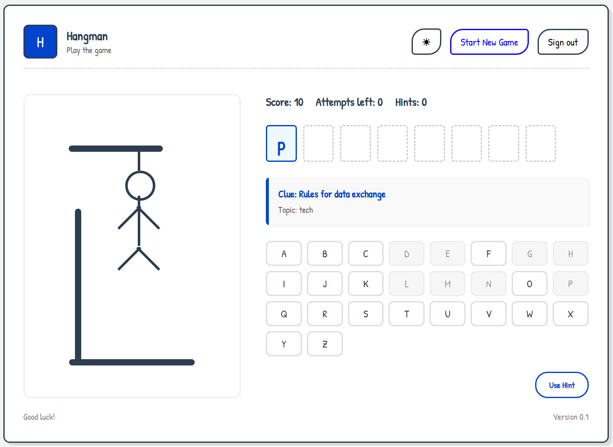](img/game_wireframe.png)


## Task 8 - Construct basic storyboards associated with the game-play/app use

The storyboard on how the application is going to function.

When the user opens the app, they are met with the index page.
This page contains the game title, game logo, game rules, description and buttons to either register or login.

[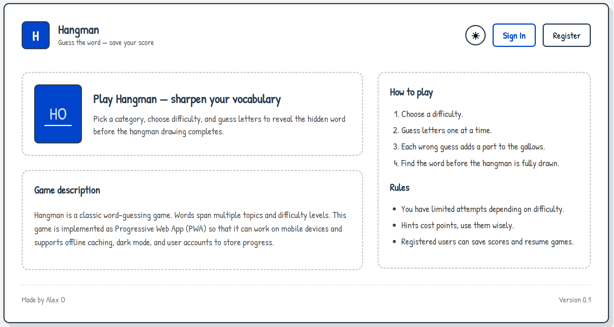](img/index_page_wireframe.png)


The user can either click to register and then they are met with the registration page.
On the registration page the user can create an account by providing a username, password and email address.

[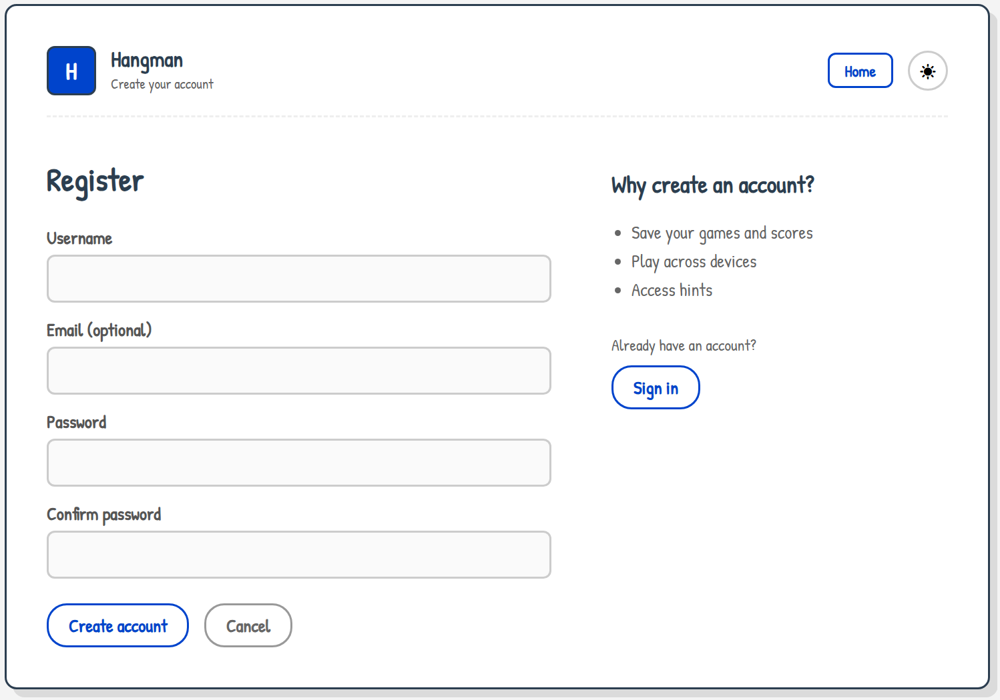](img/register_page_wireframe.png)


If the user already has an account, they can select to login and they are met with the login page.

[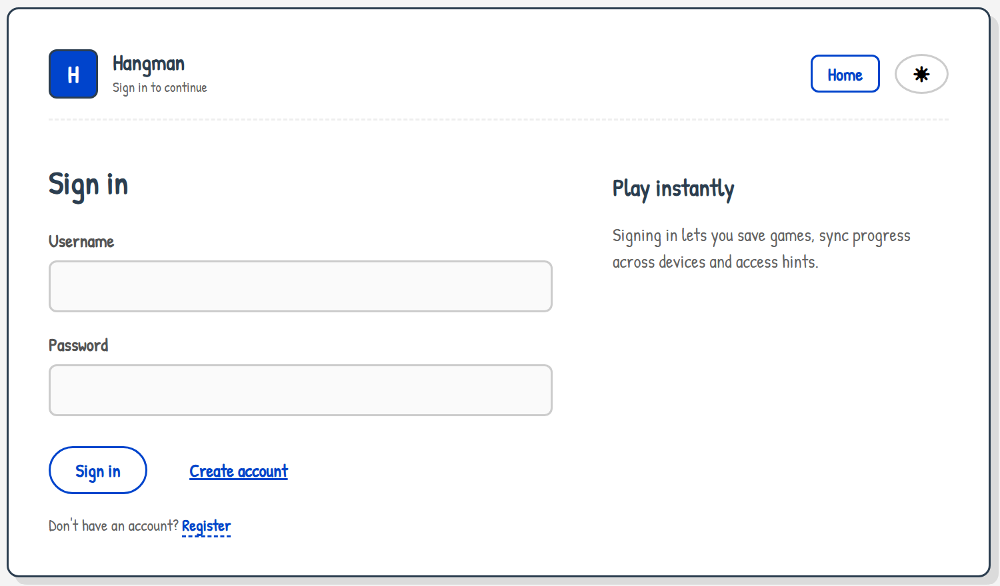](img/login_page_wireframe.png)


## Task 9 - Identify and rank potential risks to the project’s success 

I've identified the following potential risks to the project's success along with their mitigation strategies:

| Category                           | Description                                                                                                        | Mitigtion Strategy                                                                                                                                             |
|------------------------------------|--------------------------------------------------------------------------------------------------------------------|----------------------------------------------------------------------------------------------------------------------------------------------------------------|
| Lack of Knowledge About frameworks | When dealing with new Python frameworks I may not know all of their core features and functionalities well enough. | Allocate time for learning and experimenting with the frameworks before starting development to build familiarity and confidence.                              |
| Scope creep                        | The project may become too big to handle to be done solo if I keep adding more and more features to the scope.     | The scope should be frozen to MVP features only to ensure it can be delievered by the deadline and later additional features can be added if the time permits. |
| Time management                    | I may underestimate the time required to complete certain tasks leading to delays.                                 | Create a detailed project plan with realistic time estimates and buffer time for unexpected delays.                                                          |
| Technical challenges               | Unforeseen technical issues may arise during development.                                                          | Conduct thorough research and planning before implementation to identify potential challenges and solutions.                                                  |


---

## Task 10 - Software development strategy 

I've compared three software development strategies Waterfall, Agile and Rapid Application Development (RAD) as the main three candidates to select from as a software development strategy for my Hangman game app.
I've used the following sources [8], [9] and [12] stated in the References section to help me with the comparison of the three strategies.

### Comparison of the three strategies

Overall the three software development strategies can be summarised and compared as follows:

| Criteria                 | Waterfall                        | Agile                               | Rapid Application Development (RAD)   |
|--------------------------|----------------------------------|-------------------------------------|---------------------------------------|
| Flexibility              | Low - rigid phases               | High - iterative and adaptive       | High - iterative protyping            |
| Speed of Delivery        | Slow - sequential phases         | Fast - frequent releases            | Very Fast - rapid prototyping         |
| User Involvement         | Low - mainly at start and end    | High - continuous feedback          | Very High - constant user feedback    |
| Documentation            | Extensive upfront documentation  | Minimal - just enough               | Minimal - focus on working prototypes |
| Risk Management          | High risk if requirements change | Low risk through constant feedback  | Low risk due to adaptability          |  
| Team Size Suitability    | Large teams                      | Small to medium teams               | Small teams                           |
| Project Size Suitability | Large projects                   | Medium projects                     | Small projects                        |
| Outcome Focus            | Deliver complete product at end  | Deliver working software frequently | Deliver working prototypes quickly    |

### Advantages and Disadvantages of Waterfall

**Advantages:**
1. Clear Structure: Waterfall provides a clear and structured approach to development with defined phases.
2. Documentation: Extensive documentation is created upfront, which can be useful for future reference.
3. Predictability: The sequential nature of Waterfall allows for better predictability in terms of timelines and deliverables.
4. Easy to Manage: The linear approach makes it easier to manage and track progress.
5. Well-suited for Stable Requirements: Waterfall works well when requirements are well-defined and unlikely to change.

**Disadvantages:**
1. Inflexibility: Waterfall is rigid and does not easily accommodate changes once a phase is completed.
2. Delayed Testing: Testing is done at the end, which can lead to late discovery of issues.
3. User Involvement: Limited user involvement during development can lead to a final product that does not meet user needs.
4. Risk of Failure: If requirements change, the project may fail or require significant rework.
5. Not Suitable for Complex Projects: Waterfall may not be effective for complex projects with evolving requirements.

### Advantages and Disadvantages of Agile

**Advantages:**
1. Flexibility: Agile is highly adaptable to changes in requirements throughout the development process.
2. Frequent Deliveries: Agile allows for frequent releases of working software, providing value to users early and often.
3. User Involvement: Agile emphasizes continuous user feedback, ensuring the final product meets user needs.
4. Risk Reduction: The iterative approach reduces the risk of project failure due to changing requirements.
5. Collaboration: Agile promotes collaboration among team members and stakeholders.

**Disadvantages:**
1. Less Documentation: Agile often has less upfront documentation compared to Waterfall, which can lead to challenges in maintenance and future development.
2. Resource Intensive: Agile can require significant resources such as skilled developers and active user involvement.
3. Scope Creep: The flexibility of Agile can lead to scope creep if not managed properly.
4. Not Suitable for Large Projects: In its original form Agile is typically better suited for small to medium-sized projects but for large projects it may require scaling frameworks.
5. Requires Skilled Team: Agile requires a team with strong skills and experience to effectively manage the iterative process.

### Advantages and Disadvantages of RAD

**Advantages:**
1. Speed: RAD allows for rapid development and quick turnaround times, making it ideal for projects with tight deadlines.
2. Flexibility: The iterative nature of RAD allows for changes and adjustments based on user feedback throughout the development process.
3. User Involvement: similar to Agile RAD emphasizes constant user feedback, ensuring that the final product meets user needs and expectations.
4. Reduced Risk: The ability to adapt and pivot based on feedback reduces the risk of project failure due to changing requirements.
5. Focus on Prototyping: RAD focuses on creating working prototypes quickly, allowing for early testing and validation of ideas.

**Disadvantages:**
1. Limited Documentation: similar to Agile RAD often results in minimal documentation, which can lead to challenges in maintenance and future development.
2. Resource Intensive: like this is the case with Agile RAD can require significant resources in terms of a team of senior developers and increased user involvement, which may not be feasible for all projects.
3. Scope Creep: The flexibility of RAD can also lead to scope creep if not managed properly, as users may continuously request changes and additions.
4. Not Suitable for Large Projects: RAD is typically better suited for small to medium-sized projects, and may not be effective for large, complex projects.
5. Requires Skilled Team: similar to Agile RAD requires a team with strong skills and experience to manage the rapid development process.

### Reasons for choosing RAD for my project

My thought process for choosing RAD as the software development strategy for my Hangman game project is as follows.
I've rejected the Waterfall strategy because of its rigidity and inflexibility to changes which is not suitable for my project as I expect many smaller and bigger changes to happen during the development based on user feedback.
I also rejected Agile because although it is flexible and adaptive, it may not provide the speed of delivery that I need for my project given the tight deadline. I also don't plan having many iterations and releases but rather focus on rapid prototyping and getting user feedback on those prototypes therefore many of the Agile advantages are not that relevant for my project.
After checking the advantages and disadvantages of all three strategies, I've decided that RAD is the best fit for my project because it offers the speed of delivery and flexibility that I need to meet the project deadline while also allowing for constant user feedback and iteration.

Several particular reasons contributed to my decision in favour of RAD are outlined below:
1. My game project requires speed of delivery and flexibility which RAD perfectly provides.
2. I expected minimum of upfront planning so waterfall with its rigid planning and significant planning overhead wouldn't work.
3. Time sensitivity - as the delivery has to happen in about one month time the turnaround should be really fast to deliver the project as per the defined scope meeting the deadline.
4. Process-wise - I aim to hit the ground running by prototyping features, testing them by users, getting feedback and iterating fast.
5. Documentation-wise - RAD allows me to focus on working prototypes first and document them later when things settle down.
6. With RAD the identified project risks are reduced through the constant user feedback so that pivoting can happen after each prototype say some new UX features to be added like dark vs light theme switching. 
7. RAD works great for small teams and because I am doing the project solo RAD fits very well for this kind of one-man-orchestra setup.
8. RAD is good for small projects and my project is small in scope and also has to happen within a short span of time.
9. Outcome focus: deliver working prototype quickly and then iterate fast to implement all MVP features so that the game crystalises into its final version and become ready for the final submission.

---

## Task 11 - Overall Test Plan

### Overall test strategy

The overall test strategy for the Hangman game involves a combination of manual testing and automated unit tests to ensure the game functions correctly and meets user requirements.
Such combination of manual functional testing and unit tests covering the code allows to achieve high quality of the software being developed such as our crossword game.
The manual testing will focus on the user interface, game state logic, and overall user experience to ensure that the game behaves as expected from a player's perspective.
The unit tests will focus on the backend logic, including REST API endpoints, game mechanics, and scoring to ensure that the core functionality of the game is robust and reliable.
Also, performance testing and accessibility testing will be performed to ensure that the game loads quickly and is usable by players with disabilities.

#### Manual Testing

Manual tests are going to be done on the frontend to test the user interface, game state logic like scoring, game over and overall user experience.
For the manual testing a range of test cases will be created to cover all the main user flows and edge cases. 
For frontend part the Dev Tools in the browser will be used to inspect the game state, network calls and console logs to verify the correctness of the game behaviour.

The manual tests will cover the following areas:
1. Game start and main game layout.
2. Hidden word rendering and letter input.
3. Letter guessing and validation.
4. Scoring system and HUD updates.
5. Hint functionality.
6. Game win and game over screens.
7. User account creation and login.
8. Resume game feature when a user logs off and logins back again.
9. Resume game feature when the browser is refreshed or when user log ins from another device.
10. Responsive design on different screen sizes and devices.

The detailed manual test cases will be documented as part of the Activity 4 below.

#### Unit Tests

Unit tests are to be done on the backend to test the REST API endpoints, game logic, scoring etc.
pytest framework can be used for unit testing of the backend part.

#### Performance Testing

Given the scope and nature of the Hangman game, performance testing is not a primary focus.
However, basic performance checks will be conducted to ensure that the game loads quickly and responds promptly to user actions.
To achieve this, tools like Lighthouse part of the browser's Dev Tools can be used to measure page load times and responsiveness.

#### Accessibility Testing

Accessibility testing will be performed to ensure that the game is usable by players with disabilities.
This includes testing for keyboard navigation and color contrast.

---

# Activity 2 - Design Analysis Session

## Task 1 - Refining and improving 

Task 1 – Refining and Improving

After reviewing my initial specifications from Activity 1, I've refined the scope and simplified certain elements to make sure the Hangman game could be fully developed within the allocated timeframe.

Improvements and Adjustments

| Area                      | Original Idea                                        | Issue Identified                                                  | Improvement Implemented                                                                                                       |
|---------------------------|------------------------------------------------------|-------------------------------------------------------------------|-------------------------------------------------------------------------------------------------------------------------------|
| Difficulty Levels         | Multiple difficulty levels (easy/medium/hard/insane) | Decided to include this into the MVP scope on a best effort basis | Implemented four difficulty levels (easy, medium, hard, insane) based on word length and complexity                           |
| Timer Feature             | Optional countdown and stopwatch                     | Not essential for the MVP hence stayed in Phase 2                 | Kept timer feature outside MVP to focus on core gameplay mechanics                                                            |
| Scoring System            | Combo/streak bonuses and advanced logic              | Over-complicated for MVP                                          | Simplified to +10 points for each correctly guessed letter present in the hidden word                                         |
| UI / UX Design            | Basic black-and-white layout                         | Degraded overall user experience                                  | Added elaborate CSS layout to improve visual appeal and user engagement                                                       |
| Accessibility             | Minimal colour contrast only                         | Needed better readability and accessibility                       | Ensured high contrast ratio and added keyboard navigation support                                                             |
| Testing Plan              | Only three manual tests                              | Limited coverage of key functions of my Hangman game app          | More manual tests for frontend part are to be done to test user flows, game logic etc as this is the key way to find any bugs |
| Backend Persistence       | No backend persistence planned                         | Risk of losing user progress on refresh or logout                  | Added backend persistence to save user accounts, game states and scores into the database                                     |

These refinements make the project **achievable, UX user-friendly, crossplatform and stable**, ensuring that the core gameplay experience is solid while still allowing for future enhancements.


## Task 2 - agree project requirements and specifications

After refining initial set of ideas, I identified the final set of requirements that are realistic to deliver within the deadline.
The final requirements focus on delivering a polished and functional Hangman game that meets user needs while being feasible to implement within the project constraints.

#### Final Functional Specifications
1. Player can start a new game from the main game page after logging in.
2. Player gets a random word from a predefined vocabulary of words with topics, clues and difficulty levels for each new game started.
3. Simple scoring system whereas for each correctly guessed letter the player scores 10 points.
4. Player is given real-time feedback on guesses made - correct guesses reveal letters in the hidden word and incorrect guesses progress the gallows graphic.
5. Player can use hints to reveal letters in the hidden word at a penalty of 10 points per hint used.
6. Game HUD displays current score, attempts left and hints used.
7. Gameboard displays the hidden word as empty boxes, alphabet letters for guessing and gallows graphic.
8. Game is responsive and works on desktop, tablet and mobile devices.
9. Player can create an account and log in to save scores and progress.
10. Player can resume an unfinished game when logging back in or refreshing the browser.
11. Player wins the game when all letters in the hidden word are correctly guessed.
12. Player loses the game when they run out of allowed guess attempts.
13. Final game state (win/loss) is displayed.
14. Backend persists user accounts, game states and scores into the database in order to allow resuming games and tracking scores.

#### Final Non-Functional Specifications
- Loads within 3 seconds.  
- Works on mobile, tablet, desktop with mobile being the primary target.
- Clean and modern UI design with appealing aesthetics.
- High-contrast colours and readable fonts.
- Keyboard navigation support for accessibility.
- Modular code using Python, HTML, CSS and JavaScript.  
- Deployed as a web app using FastAPI backend.

Above requirements have been prioritised to focus on core gameplay mechanics, user experience and essential features that make the game enjoyable and functional.

---

## Task 3 - Psuedocode

The pseudocode below outlines the main logic and gameplay flow for the Hangman game app.  
It shows how the player interacts with the game, how answers are checked, and how the score is updated.

```plaintext
START GAME
  DISPLAY main menu

  IF user clicks "Start New Game"
      LOAD hidden word
      DISPLAY topic and clue
      SET score = 0
      SET attemptsLeft = maxAttempts
      SET hintsUsed = 0

      WHILE game not finished
          WAIT for player input (letter guess or hint request)

          IF input matches a letter present in hidden word
              UPDATE hidden word display with guessed letter
              INCREASE score by 10
          ELSE
              DISPLAY next gallows stage
              DECREASE attemptsLeft by 1
              DISABLE guessed letter button

          IF player clicks "Use Hint"
              REVEAL one random letter in selected word
              DECREASE score by 10
              INCREASE hintsUsed by 1

          IF letters guessed == total letters in hidden word
              DISPLAY "You Win!" message
              EXIT LOOP
          ELIF attemptsLeft == 0
              DISPLAY "Game Over!" message
              EXIT LOOP
          END IF
      END WHILE

      SAVE progress into the database
      DISPLAY final score
  END IF

END GAME
```


## Task 4 - UML Flowchart

The UML flowchart below represents the overall game logic and user interaction flow for the Hangman game app.  
It helps visualize how the game starts, how player input is processed, and how the program determines when the game is complete.

#### Description of Flow

1. The new game starts when the player clicks the **Start New Game** button on the main game page.
2. Hidden word is loaded and displayed as empty boxes along with topic and clue.
3. Alphabet is displayed for letter guessing.
4. HUD is displayed showing current score, attempts left and hints used.
5. Gallows area is displayed empty.
6. Player inputs a letter guess or clicks **Use Hint**.
7. The program checks if the guessed letter is in the hidden word.
   - If correct → letter is revealed in the hidden word and score increases by 10 points.  
   - If incorrect → gallows graphic progresses to next stage and attempts left decreases by 1.
8. If player clicks **Use Hint** → one letter is revealed in the hidden word and score decreases by 10 points.
9. The program checks if all letters in the hidden word are guessed.
   - If yes → display **"You Win!"** message and final score.  
   - If no → continue playing.
   - If attempts left reaches 0 → display **"Game Over!"** message and final score.
10. The player’s progress is saved into the database after each action done by a player.

#### UML Flow (Text-Based Representation)

```plaintext
          ┌─────────────────────┐
          │     START GAME      │
          └─────────┬───────────┘
                    │
                    ▼
        ┌──────────────────────┐
        │ Display Game Page    │
        └─────────┬────────────┘
                  │
         ┌────────▼────────┐
         │ User clicks     │
         │ "Start New Game"│
         └────────┬────────┘
                  │
        ┌─────────▼───────────────┐
        │ Load hidden word        │
        │ & Display topic and clue│
        └─────────┬───────────────┘
                  │
          ┌───────▼────────┐
          │ Player Inputs  │
          │ letter         │
          └───────┬────────┘
                  │
     ┌────────────▼────────────┐
     │ Is Letter Correct?      │
     ├────────────┬────────────┤
     │ Yes        │ No         │
     ├────────────┼────────────┤
     │ Update HUD │ Display    │
     │ +10 Points │ next gallows│
     │            │ stage and  │
     │            │ -1 Attempt │
     └──────┬─────┴────────────┘
            │
  ┌─────────▼──────────────┐
  │ Player Clicks Use Hint │
  ├────────────────────────┤
  │ Reveal Letter and      │
  │ -10 Pts                │  
  └─────────┬──────────────┘
            │
    ┌───────▼─────────────┐
    │ All letters guessed?│
    ├─────────┬───────────┤
    │ Yes     │ No        │
    ├─────────┼───────────┤
    │ Display │ Wait for  │
    │ “You Win” │ Input   │
    └───────┬─────────────┘
            │
    ┌───────▼─────────────┐
    │ No more attempts?   │
    ├─────────┬───────────┤
    │ Yes     │ No        │
    ├─────────┼───────────┤
    │ Display │ Wait for  │
    │ “You Lost” │ Input  │
    └───────┬─────────────┘
            │
    ┌───────▼─────────┐
    │ Save Progress   │
    │ Update HUD      │
    └───────┬─────────┘
            │
            ▼
     ┌───────────────┐
     │    END GAME    │
     └───────────────┘
```


 ## Task 5 - Game State management

This section defines how the game manages and tracks different states such as **Start**, **Win**, **Lose** as well as how these states are detected and updated during the gameplay.

#### Game States
1. **Start State** – The game begins when the player clicks the **Start New Game** button on the game page.  
   - Hidden word is loaded and displayed as empty boxes along with topic and clue.
   - Alphabet is displayed for letter guessing.
   - HUD is displayed showing current score, attempts left and hints used.
   - Gallows area is displayed empty.
   - Game score, hints used are set to zero.

2. **Active State** – The player is actively guessing letters and interacting with the on-screen alphabet and hint button.
   The game remains in this state while there are still words to be guessed and the player has remaining guess attempts.
   - the player selects a letter on the on-screen alphabet and licks on it this way submitting the guess to the backend to check if the letter guess is correct and gets response and updates the game state accordingly.
   - if the player correctly guessed the letter then the letter is revealed in the hidden word on the grid and points are awarded to the game score.
   - if the player incorrectly guessed the letter then the gallows graphic progresses to the next stage and remaining guess attempts are reduced by 1.
   - if the player clicks **Use Hint** button then one random letter in the hidden word is revealed and penalty points are deducted from the game score.
   - The game state like game score, attempts left, hints used is shown in the HUD.
   - The game continues in this state until either all letters are guessed or the player runs out of guess attempts.

3. **Completed State** – Triggered when all letters are correctly guessed or when the player runs out of guess attempts.
   - When all letters are guessed the game detects this state by checking if all letters in the hidden word are revealed on the grid.
   - When the player runs out of guess attempts the game detects this state by checking if remaining guess attempts reaches zero.
   - The final game state like game score, guesses made, words solved etc is shown in the HUD.
   - The game changes its state into 'completed' so that the player can't do any actions for it.

5. **Lose State** – activated when the player runs out of guess attempts.  
   - The player loses when they run out of guess attempts.
   - A **“You Lose!”** message is displayed.
   - The final game state like game score, hints used is shown in the HUD.
   - The game changes its state into 'completed' so that the player can't do any actions for it.
   - The gallows graphic is fully displayed showing the complete hangman.

5. **Win State** – activated when the player correctly guesses all letters in the hidden word.
   - The player wins when all letters in the hidden word are correctly guessed.
   - A **“You Win!”** message is displayed.
   - The final game state like game score, hints used etc is shown in the HUD.
   - The game changes its state into 'completed' so that the player can't do any actions for it.


#### Game Logic Overview

- **Guess letter function:**  
  - Compares the player’s input represented by the letter clicked on the on-screen alphabet with the hidden word.
  - If the letter matches at least one letter in the hidden word → reveal the letter in the hidden word on the grid and award 10 points to the game score.
  - If the letter does not match any letter in the hidden word → progress the gallows graphic to the next stage and reduce remaining guess attempts by 1.
  - If the player runs out of guess attempts after an incorrect guess → trigger **Lose State**.
  - If all letters are guessed after a correct guess → trigger **Win State**.

- **Use Hint function**  
  - Reveals one random letter in the selected word on the grid.
  - Deducts 10 points from the game score.
  - Increases hints used count by 1.
  - If all letters are guessed after using a hint → trigger **Win State**.

#### Win / Lose Conditions

- **Win:** All letters in the hidden word are correctly guessed before running out of guess attempts.
- **Lose:** Player runs out of guess attempts before guessing all letters in the hidden word.

---

This design ensures that the game effectively manages and tracks different states, providing a clear and engaging gameplay experience for the player.

## Architecture Design

### Technology stack and overall approach

As per the assignment brief the platform should be mobile first.
The stack is suggested as: JavaScript, CSS, HTML5, Python (FastAPI) and SQLite or similar lightweight database.
To fulfil the mobile first requirement the app will be designed as a Progressive Web App (PWA) so that it can be installed on mobile devices and work offline.
The backend will be built using FastAPI framework in Python which is lightweight and fast to develop REST APIs.
The frontend will be built using standard web technologies - HTML5, CSS and JavaScript.
For the database part I can use SQLite as a lightweight database to store user accounts, game states and scores.
Overall this stack is well suited for building a mobile first web app with a Python backend and a JavaScript frontend.

### Architecture design decisions

After reviewing the technology stack I decided to go with the following architecture design for my Hangman game app.
I am using a client-server architecture.
I am going to have a FastAPI based backend server (controller) which will do the heavy lifting like handling the game logic, scoring etc.
The backend will expose a REST API which the frontend (view) will call to start new game, get game state, submit guesses, use hints etc.
The FastAPI backend also will serve the frontend which will be a PWA web app using JavaScript, HTML and CSS. They together will render the gameboard, gallows, HUD etc coming in the REST API responses from the backend.
The JavaScript part of the frontend will call the backend REST API to get game state, submit guesses etc and then help rendering this dynamic data onto the HTML rendered by a browser to a player.
The backend will use a SQLite database to store the game data (words, users, games etc.) This way the game data will be persisted across sessions and players can resume their games later.
The FastAPI backend app from one side will be offering REST API endpoints to be called by the frontend and from the other side will be serving the frontend static files (HTML, CSS, JS). 
I will use FastAPI's capability to serve static files for this purpose. This way my FastAPI backend represents a hybrid app which serves both as a REST API server and as a static files server for the frontend.
This makes such architecture simple and easy to deploy as I will have a single FastAPI app to deploy which serves both the backend REST API and the frontend static files.
Also, having REST API being offered by the FastAPI backend makes the architecture scalable and extensible as in future I can have multiple frontend clients (e.g. mobile Android or iPhone app, desktop app etc.) calling the same REST API endpoints to play the Hangman game.
Most importantly, FastAPI is lightweight and fast to develop REST APIs which suits well the Rapid Application Development (RAD) strategy I am going to follow for this project.
Having the backend in the form of FastAPI REST API server also allows to offer my Hangman game to many players concurrently as FastAPI is designed to handle multiple requests efficiently. 
It also allows to easily extend the game in future by adding more features and endpoints to the REST API as needed.
Implementing the frontend as a PWA web app allows to meet the mobile first requirement as PWAs can be installed on mobile devices and work offline so that I don't need to develop iOS or Android native apps but offer my Hangman game as a PWA which can be accessed from any modern mobile browser.

The app architecture can be schematically represented on the following diagram shown below:

[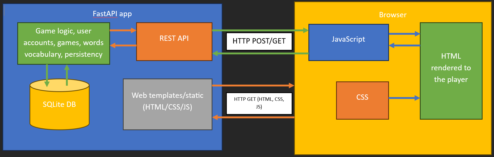](img/architecture.png)

When a player opens the Hangman game in their browser the following sequence of interactions happens:
1. The browser sends an HTTP GET request to the FastAPP backend server to load the main HTML page of the Hangman game.
2. The FastAPI backend serves the static HTML, CSS and JS files to the browser.
3. The browser renders the HTML page and executes the JavaScript code.
4. The JavaScript code sends an HTTP request to the FastAPI backend REST API to start a new game.
5. The FastAPI backend selects a random word, initializes the game state, persists it into the DB and sends back the game data in the REST API response.
6. The JavaScript code processes the REST API response and renders the gameboard, gallows, HUD etc. on the HTML page.
7. As the player interacts with the game (submits guesses, uses hints etc.) the JavaScript code sends further REST API requests to the FastAPI backend to update the game state and get responses.
8. The FastAPI backend processes these requests, updates the game state, writes it into the DB and sends back the updated data in the REST API responses.
9. The JavaScript code updates the HTML page based on the REST API responses to reflect the current game state.
10. When the game ends (win/lose) the JavaScript code displays the final results to the player.

---

# Activity 3 – Coding

## Code Repository

The code for this project is hosted on GitHub at:
https://github.com/Alex-Oma/Software-Development-2-Hangman-Game

## Git Branching Strategy

I've decied to go with the following branch strategy on GitHub:
- `main` branch: Stable production-ready code.
- `new_stuff` branch: Development branch for new features and experiments.
- Feature branches: Created from `new_stuff` for specific features or bug fixes, then merged back into `new_stuff` after review and testing.
- Merging `new_stuff` into `main` only after thorough testing and validation to ensure stability.
- Regular commits and pull requests to maintain code quality.


## Development notes — Backend (FastAPI) + PWA skeleton
To start with, I've created a simple FastAPI backend with a minimal PWA front-end skeleton as my kind of iteration 0. 

Running the backend on Windows:

1. Create a virtual environment:

   python -m venv .venv
   .venv\Scripts\activate

2. Install dependencies:

   python -m pip install -r requirements.txt

3. Run the app locally with uvicorn:

   python -m uvicorn backend.app.main:app --reload --port 8000

4. Open the PWA in the browser:

   http://127.0.0.1:8000/frontend/static/index.html

PowerShell helper: `run_local.ps1` is provided which runs uvicorn for convenience.

Unit tests can be run from the tests folder with:
python -m pytest -q

## Debugging notes

To debug the FastAPI backend, I've used the built-in logging module to log important events and errors.
This helps to trace the flow of execution and identify any issues that arise during runtime.
For frontend debugging, I've utilized the browser's developer tools to inspect the HTML, CSS and JavaScript code.
This allows me to see the DOM structure, CSS styles and JavaScript console logs to identify any issues with the UI or functionality.
I've also used breakpoints in the JavaScript code to step through the code and observe variable values and program flow.
Additionally, I've implemented error handling in both the backend and frontend to catch and log any exceptions that occur during execution.
This helps to identify and resolve issues more effectively.

## Development notes — Frontend (PWA)

To develop the frontend of my Hangman game as a Progressive Web App (PWA), I've followed these steps:
1. Set up the project structure: Created a folder structure for the PWA with separate folders for HTML, CSS, JavaScript and images.
2. Created the main HTML file: Developed the main HTML file that serves as the entry point for the PWA. This file includes the necessary meta tags for PWA functionality and links to the CSS and JavaScript files.
3. Designed the UI: Used CSS to style the PWA and create a visually appealing and user-friendly interface for the Hangman game.
4. Implemented PWA features: Added a manifest file to define the PWA's name, icons and theme colors. Implemented a service worker to enable offline functionality and caching of assets.
5. Developed the game logic: Used JavaScript to implement the game logic, including handling user input, updating the game state and rendering the game board.
6. Integrated with the backend: Set up API calls to the FastAPI backend to fetch game data, submit guesses and update the game state.
7. Tested the PWA: Tested the PWA on different devices and browsers to ensure compatibility and responsiveness.
8. Deployed the PWA: Deployed the PWA as part of the FastAPI backend so that it can be accessed by users.

---

# Activity 4 – Testing

## Frontend Testing

### CSS layout smoke test: Pass

Very first basic smoke test to ensure that the CSS layout is loading correctly without any major issues.

Light mode screenshot:
[](img/testing/frontend/initial_ui_layout_test_light.png)

Dark mode screenshot:
[](img/testing/frontend/initial_ui_layout_test_dark.png)

### Manual Testing Plan and Test Cases with Results

Provided below is the manual testing plan and test cases for the frontend of the Hangman game and their test results with test evidence.

| Test Case ID | Test Description                                                                                          | Expected result                                                                                                                                                                                                                                                                                                                                                                   | Actual result                                                                                                                                                                                                                                                                                                                     | Evidence                                                                                                                                                                                                                                                         | Passed? |
|--------------|-----------------------------------------------------------------------------------------------------------|-----------------------------------------------------------------------------------------------------------------------------------------------------------------------------------------------------------------------------------------------------------------------------------------------------------------------------------------------------------------------------------|-----------------------------------------------------------------------------------------------------------------------------------------------------------------------------------------------------------------------------------------------------------------------------------------------------------------------------------|------------------------------------------------------------------------------------------------------------------------------------------------------------------------------------------------------------------------------------------------------------------|---------|
| TC001        | Theme button to switch from light theme to dark theme.                                                    | When the button is clicked, the page is  expected to switch from light theme to dark theme.                                                                                                                                                                                                                                                                                       | When the button is clicked, the page switches from light theme to dark theme.                                                                                                                                                                                                                                                     | [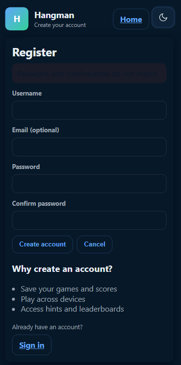](img/testing/frontend/1.png)                                                                                                                                                                               | Yes     |
| TC002        | Theme button to switch from dark theme to light theme.                                                    | When the button is clicked, the page is expected to switch from dark theme to light theme.                                                                                                                                                                                                                                                                                        | When the button is clicked, the page switches from dark theme to light theme.                                                                                                                                                                                                                                                     | [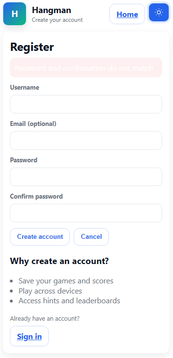](img/testing/frontend/2.png)                                                                                                                                                                               | Yes     | 
| TC003        | Attempt to click “Create Account” with empty fields.                                                      | When attempted, a message should appear underneath the Username field and the message should say “Please fill in this field”.                                                                                                                                                                                                                                                     | When attempted, a message appears underneath the Username field and the message says “Please fill in this field”.                                                                                                                                                                                                                 | [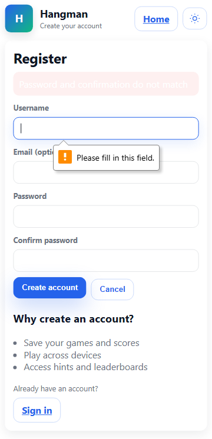](img/testing/frontend/3.png)                                                                                                                                                                               | Yes     |
| TC004        | Navigating to home page by clicking “Home” button.                                                        | When the “Home” button is clicked, the app should navigate to the home page and display the home page to the user.                                                                                                                                                                                                                                                                | When the “Home” button is clicked, the app navigates to the home page and displays the home page to the user.                                                                                                                                                                                                                     | [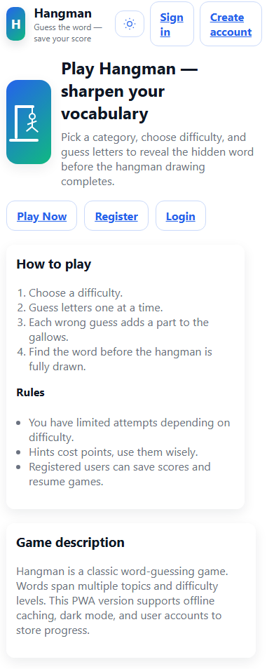](img/testing/frontend/4.png)                                                                                                                                                                               | Yes     |
| TC005        | Navigating back to home page from Registration page by clicking “Cancel” button.                          | When the “Cancel” button is clicked. The app should navigate back to the home page from the registration page.                                                                                                                                                                                                                                                                    | When the “Cancel” button is clicked. The app navigates back to the home page from the registration page.                                                                                                                                                                                                                          | [](img/testing/frontend/4.png), [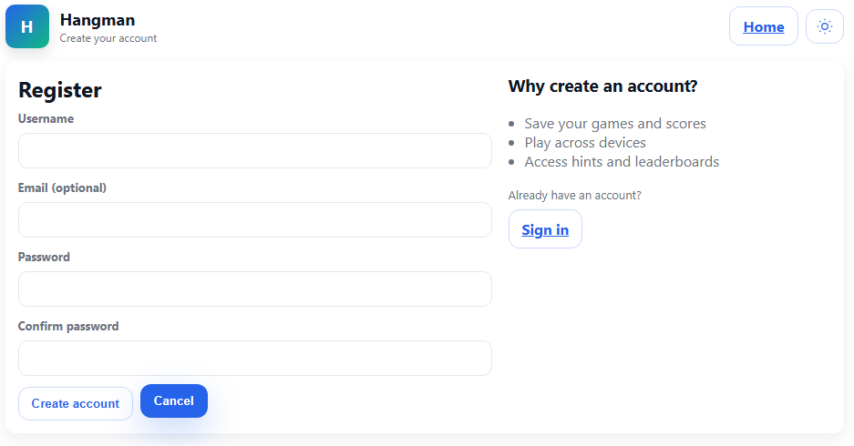](img/testing/frontend/5.png)                                                                                           | Yes     |
| TC006        | Attempt to create account with invalid email format.                                                      | The user fills in the details but enters email in invalid format and the user should get an error message saying “Please include an ‘@’ in the email address.”.                                                                                                                                                                                                                   | The user fills in the details but enters email in invalid format and the user gets an error message saying “Please include an ‘@’ in the email address.”.                                                                                                                                                                         | [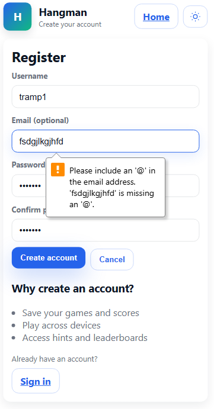](img/testing/frontend/6.png)                                                                                                                                                                               | Yes     |
| TC007        | Creating account with valid credentials                                                                   | When the user enters all the valid credentials, it is expected that they will be transferred onto the game description page.                                                                                                                                                                                                                                                      | When the user enters all the valid credentials, they are transferred onto the game description page.                                                                                                                                                                                                                              | [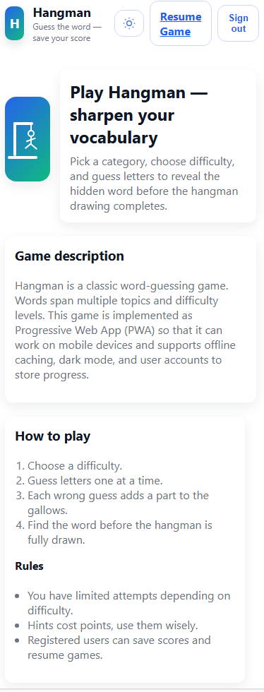](img/testing/frontend/7.png)                                                                                                                                                                               | Yes     |
| TC008        | Attempt to create account with already existing username                                                  | When the user enters the credentials of an already existing account, they are supposed to get the error message “Username already exists”                                                                                                                                                                                                                                         | When the user enters the credentials of an already existing account, they get the error message “Username already exists”.                                                                                                                                                                                                        | [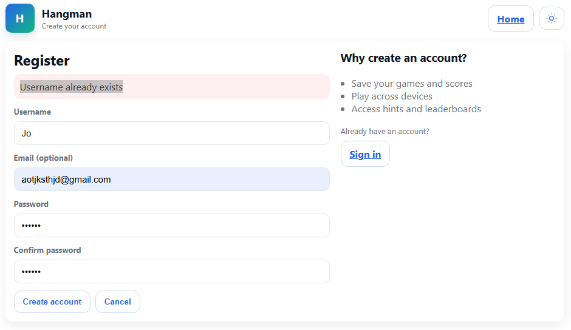](img/testing/frontend/9.png)                                                                                                                                                                               | Yes     |
| TC009        | Attempt to enter not matching passwords when creating new account                                         | When the user enters passwords that do not match when entering credentials of an already existing account, they are supposed to get the error message “Password and confirmation do not match”.                                                                                                                                                                                   | When the user enters passwords that do not match when entering credentials of an already existing account, they get the error message “Password and confirmation do not match”.                                                                                                                                                   | [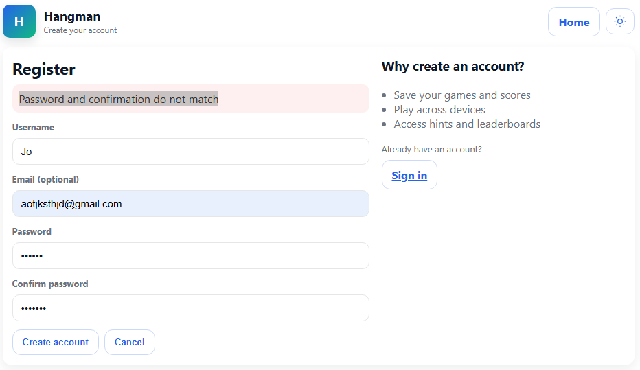](img/testing/frontend/10.png)                                                                                                                                                                             | Yes     |
| TC010        | Login page when the user enters their username and password                                               | When the user enters their correct username and password, they should be signed in successfully and transferred to the game page.                                                                                                                                                                                                                                                 | When the user enters their correct username and password, they are signed in successfully and are transferred to the game page.                                                                                                                                                                                                   | [](img/testing/frontend/16.png)                                                                                                                                                                             | Yes     |
| TC011        | User enters one wrong password                                                                            | When the user enters the wrong password, they should get an error “Invalid credentials”.                                                                                                                                                                                                                                                                                          | When the user enters the wrong password, they get an error “Invalid credentials”.                                                                                                                                                                                                                                                 | [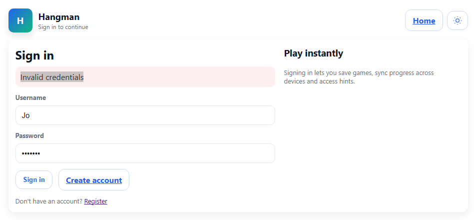](img/testing/frontend/11.png)                                                                                                                                                                             | Yes     |
| TC012        | User enters the wrong username.                                                                           | When the user enters the wrong username, they should get an error “Invalid credentials”.                                                                                                                                                                                                                                                                                          | When the user enters the wrong username, they get an error “Invalid credentials”.                                                                                                                                                                                                                                                 | [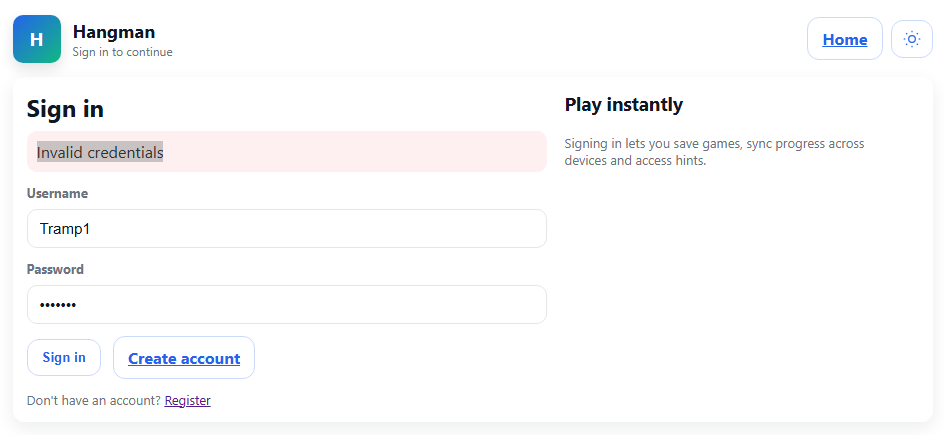](img/testing/frontend/12.png)                                                                                                                                                                             | Yes     |
| TC013        | User enters both incorrect credentials.                                                                   | When the user enters the wrong username and password, they should get an error “Invalid credentials”.                                                                                                                                                                                                                                                                             | When the user enters the wrong username and password, they get an error “Invalid credentials”.                                                                                                                                                                                                                                    | [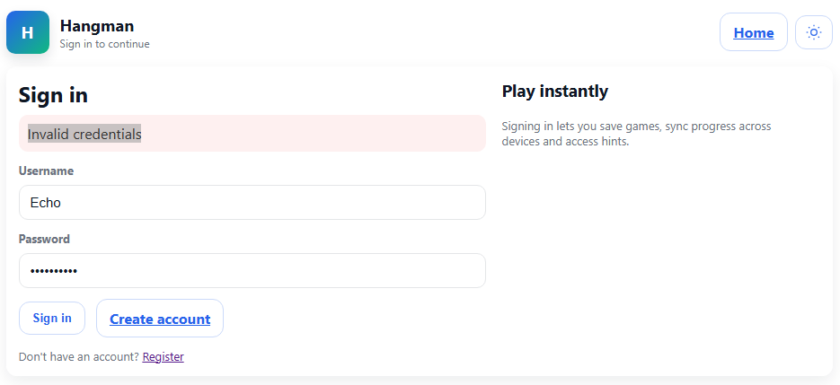](img/testing/frontend/13.png)                                                                                                                                                                             | Yes     |
| TC014        | Theme button to switch from light theme to dark theme.                                                    | When the button is clicked, the page is  expected to switch from light theme to dark theme.                                                                                                                                                                                                                                                                                       | When the button is clicked, the page switches from light theme to dark theme.                                                                                                                                                                                                                                                     | [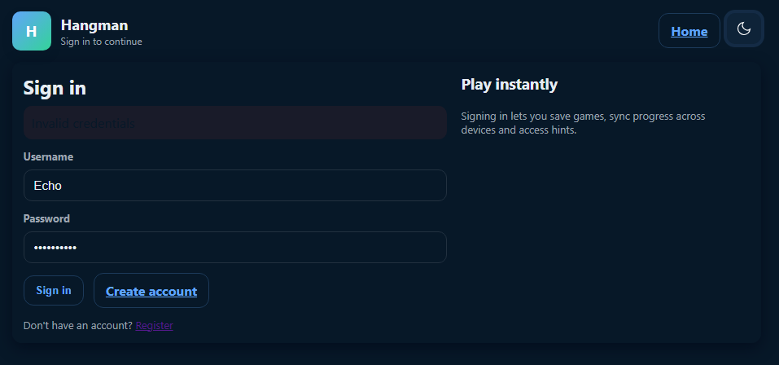](img/testing/frontend/14.png)                                                                                                                                                                             | Yes     |
| TC015        | Theme button to switch from dark theme to light theme.                                                    | When the button is clicked, the page is expected to switch from dark theme to light theme.                                                                                                                                                                                                                                                                                        | When the button is clicked, the page switches from dark theme to light theme.                                                                                                                                                                                                                                                     | [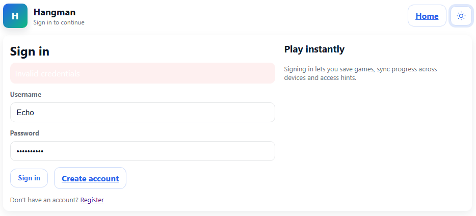](img/testing/frontend/15.png)                                                                                                                                                                             | Yes     |
| TC016        | Navigating to home page by clicking “Home” button.                                                        | When the “Home” button is clicked, the app should navigate to the home page and display the home page to the user.                                                                                                                                                                                                                                                                | When the “Home” button is clicked, the app navigates to the home page and displays the home page to the user.                                                                                                                                                                                                                     | [](img/testing/frontend/4.png)                                                                                                                                                                               | Yes     |
| TC017        | Attempt to click “Create Account”.                                                                        | When attempted, the user should be transferred to the Registration page.                                                                                                                                                                                                                                                                                                          | When attempted, the user is transferred to the Registration page.                                                                                                                                                                                                                                                                 | [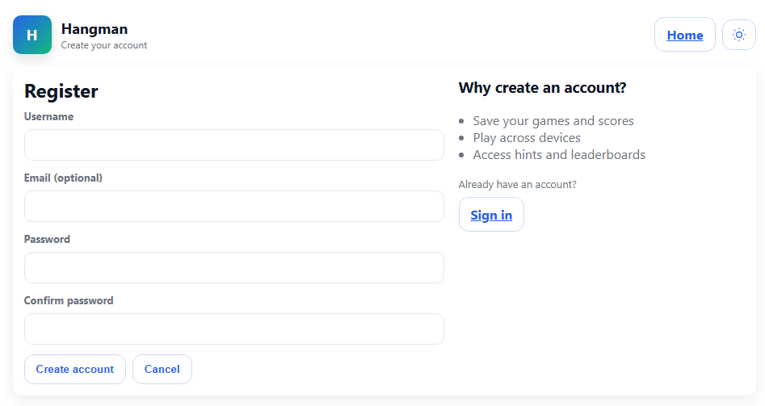](img/testing/frontend/17.png)                                                                                                                                                                             | Yes     |
| TC018        | Clicking “Resume Game” when signed in.                                                                    | The user is signed in at the moment and when the user clicks the “Resume Game” button, they should be transferred to the game screen.                                                                                                                                                                                                                                             | The user is signed in at the moment and when the user clicks the “Resume Game” button, they are transferred to the game screen.                                                                                                                                                                                                   | [](img/testing/frontend/16.png)                                                                                                                                                                             | Yes     |
| TC019        | Theme button to switch from light theme to dark theme.                                                    | When the button is clicked, the page is  expected to switch from light theme to dark theme.                                                                                                                                                                                                                                                                                       | When the button is clicked, the page switches from light theme to dark theme.                                                                                                                                                                                                                                                     | [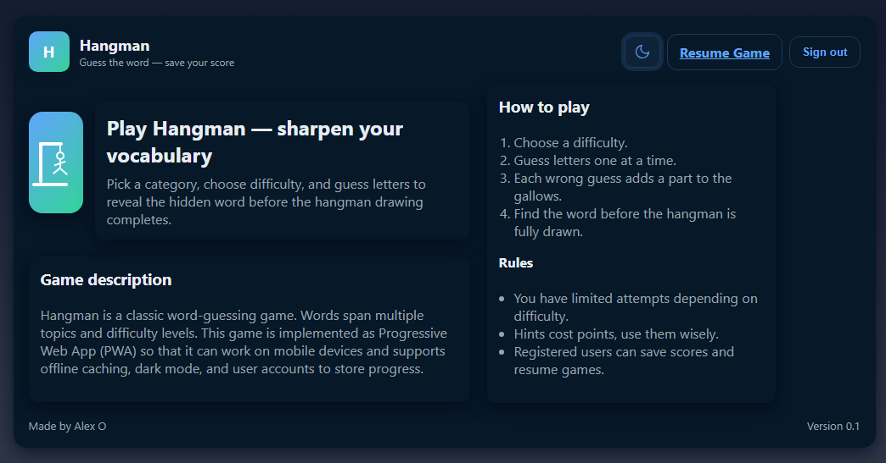](img/testing/frontend/18.png)                                                                                                                                                                             | Yes     |
| TC020        | Theme button to switch from dark theme to light theme.                                                    | When the button is clicked, the page is expected to switch from dark theme to light theme.                                                                                                                                                                                                                                                                                        | When the button is clicked, the page switches from dark theme to light theme.                                                                                                                                                                                                                                                     | [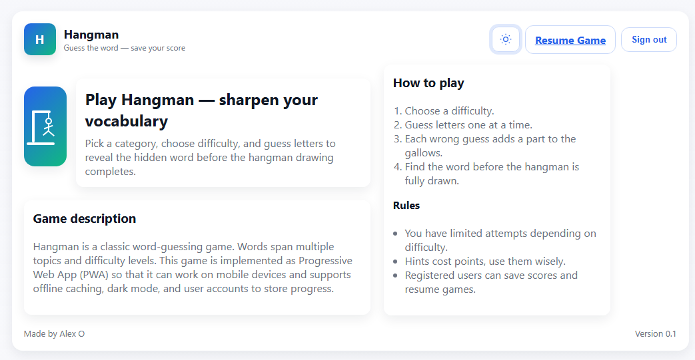](img/testing/frontend/19.png)                                                                                                                                                                             | Yes     |
| TC021        | Clicking “Sign out” button.                                                                               | Upon clicking “Sign out”, the screen should remain the same, but the options should change from “Resume Game” and “Sign out” to “Sign in” and “Create account” to show that the user has been signed out.                                                                                                                                                                         | Upon clicking “Sign out”, the screen remains the same, but the options change from “Resume Game” and “Sign out” to “Sign in” and “Create account” to show that the user has been signed out.                                                                                                                                      | [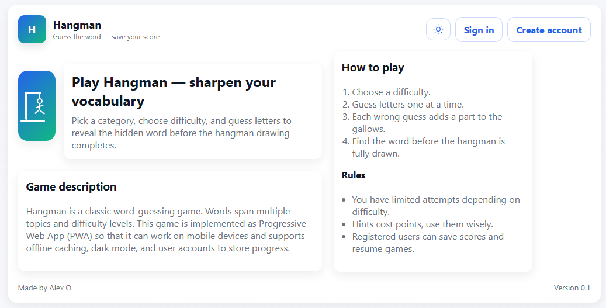](img/testing/frontend/20.png)                                                                                                                                                                             | Yes     |
| TC022        | Clicking “Sign in” button on index page                                                                   | Upon clicking the “Sign in” button, the user should be transferred to the login page.                                                                                                                                                                                                                                                                                             | Upon clicking the “Sign in” button, the user is transferred to the login page.                                                                                                                                                                                                                                                    | [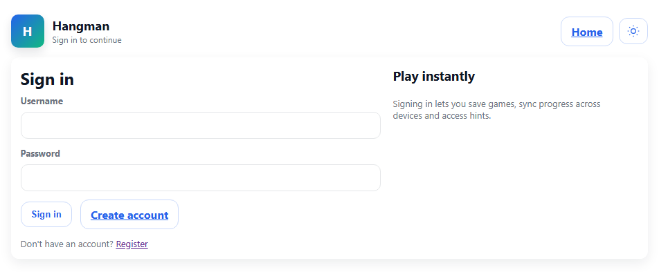](img/testing/frontend/21.png)                                                                                                                                                                             | Yes     |
| TC023        | Clicking “Create account” button on index page                                                            | Upon clicking the “Sign in” button, the user should be transferred to the registration page.                                                                                                                                                                                                                                                                                      | Upon clicking the “Sign in” button, the user is transferred to the registration page.                                                                                                                                                                                                                                             | [](img/testing/frontend/17.png)                                                                                                                                                                             | Yes     |
| TC024        | game.html page is loaded and game layout is being rendered when user logs into the game.                  | When user logs in to the  game, the game.html page is supposed to be loaded and game layout is supposed to be rendered.                                                                                                                                                                                                                                                           | When user logs in to the game, the game.html page is loaded and game layout is being rendered.                                                                                                                                                                                                                                    | [](img/testing/frontend/16.png)                                                                                                                                                                             | Yes     |
| TC025        | Theme button to switch from light theme to dark theme.                                                    | When the button is clicked, the page is  expected to switch from light theme to dark theme.                                                                                                                                                                                                                                                                                       | When the button is clicked, the page switches from light theme to dark theme.                                                                                                                                                                                                                                                     | [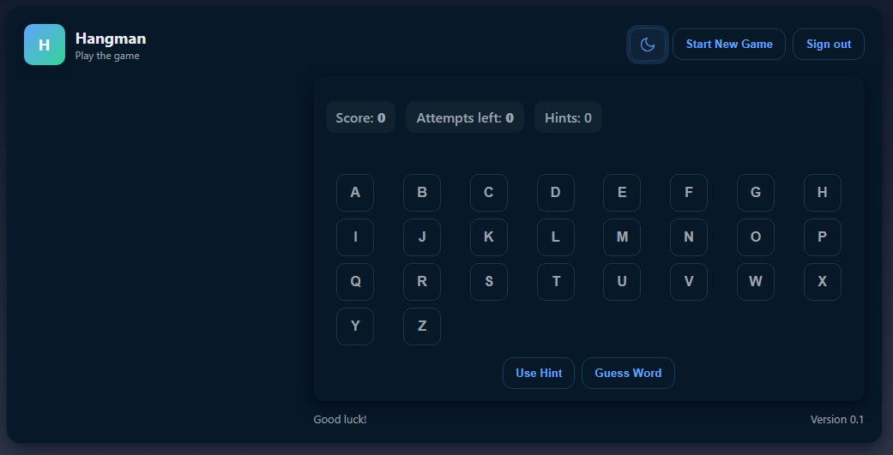](img/testing/frontend/22.png)                                                                                                                                                                             | Yes     |
| TC026        | Theme button to switch from dark theme to light theme.                                                    | When the button is clicked, the page is expected to switch from dark theme to light theme.                                                                                                                                                                                                                                                                                        | When the button is clicked, the page switches from dark theme to light theme.                                                                                                                                                                                                                                                     | [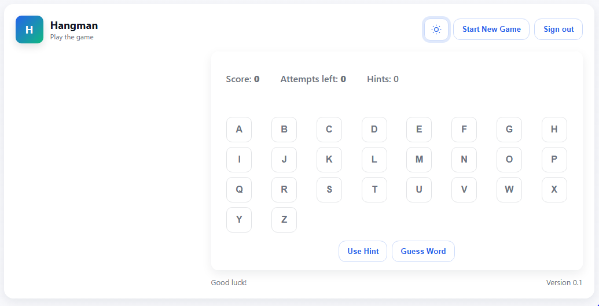](img/testing/frontend/23.png)                                                                                                                                                                             | Yes     |
| TC027        | Clicking “Sign out” option to transfer back to index.html page from game.html page.                       | When the user clicks on the “Sign out” button, they should be transferred to the index.html page.                                                                                                                                                                                                                                                                                 | When the user clicks on the “Sign out” button, they are transferred to the index.html page.                                                                                                                                                                                                                                       | [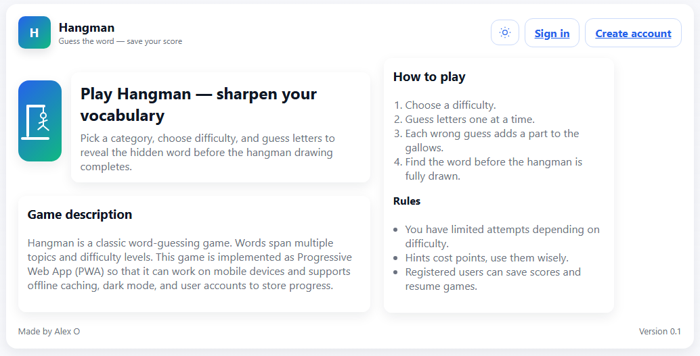](img/testing/frontend/24.png)                                                                                                                                                                             | Yes     |
| TC028        | Clicking “Start New Game”                                                                                 | When the user clicks “Start New Game”, they are supposed to get a dropdown menu of game difficulty options.                                                                                                                                                                                                                                                                       | When the user clicks “Start New Game”, they get a dropdown menu of game difficulty options.                                                                                                                                                                                                                                       | [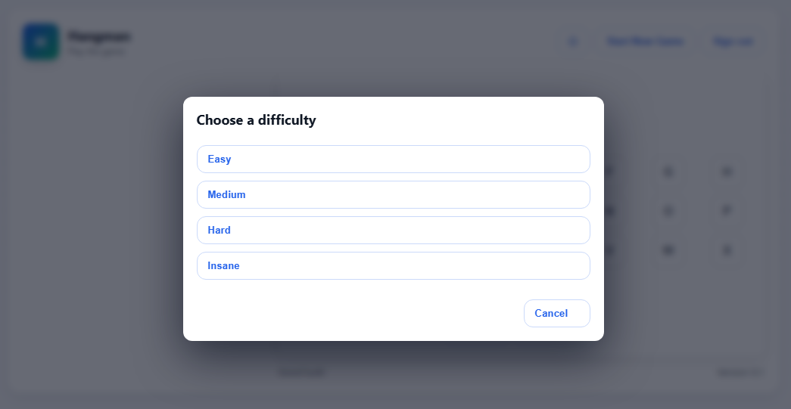](img/testing/frontend/25.png)                                                                                                                                                                             | Yes     |
| TC029        | Clicking “Cancel” button in the bottom right corner of the game difficulty menu.                          | When the user clicks the “Cancel” button, the game difficulty menu is supposed to close and the user is supposed to see the game screen again.                                                                                                                                                                                                                                    | When the user clicks the “Cancel” button, the game difficulty menu closes and the user sees the game screen again.                                                                                                                                                                                                                | [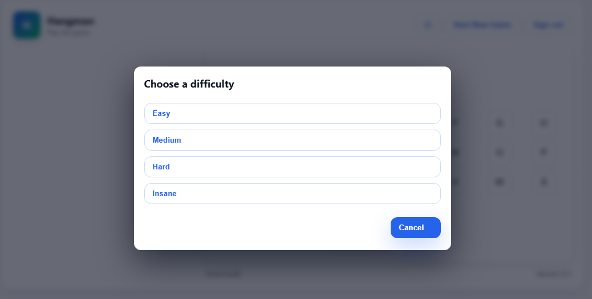](img/testing/frontend/26.png), [](img/testing/frontend/16.png)                                                                                       | Yes     |
| TC030        | Testing that game starts based on the difficulty the user has chosen                                      | The user selects “Medium” game difficulty in the game difficulty menu options. After the user selects the game difficulty, the game is supposed to start where the user should be able to see the letters, the empty spaces for the letters to be filled into, the buttons “Use Hint” and “Guess Word” and should be able to see the labels “Score”, “Attempts left” and “Hints”. | The user selects “Medium” game difficulty in the game difficulty menu options. After the user selects the game difficulty, the game starts where the user sees the letters, the empty spaces for the letters to be filled into, the buttons “Use Hint” and “Guess Word” and sees the labels “Score”, “Attempts left” and “Hints”. | [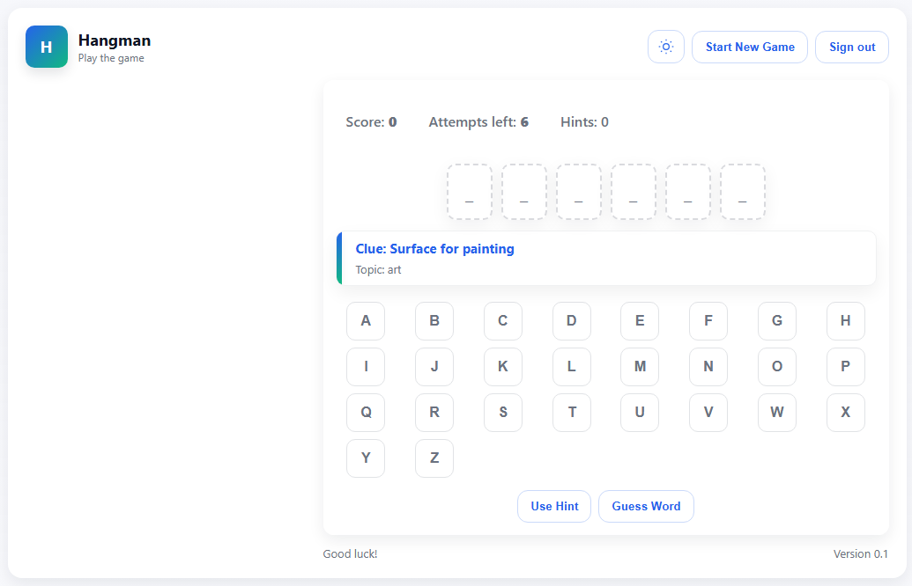](img/testing/frontend/27.png)                                                                                                                                                                             | Yes     |
| TC031        | Clicking “Start New Game” when current game is in progress.                                               | When the user clicks “Start New Game” while the current game is in progress, they should get a message with a question “Start a new game?” and a message “You haven't finished the current game. Would you like to cancel it and start a new one?” and have a yes and a no option                                                                                                 | When the user clicks “Start New Game” while the current game is in progress, they get a message with a question “Start a new game?” and a message “You haven't finished the current game. Would you like to cancel it and start a new one?” and have a yes and a no option                                                        | [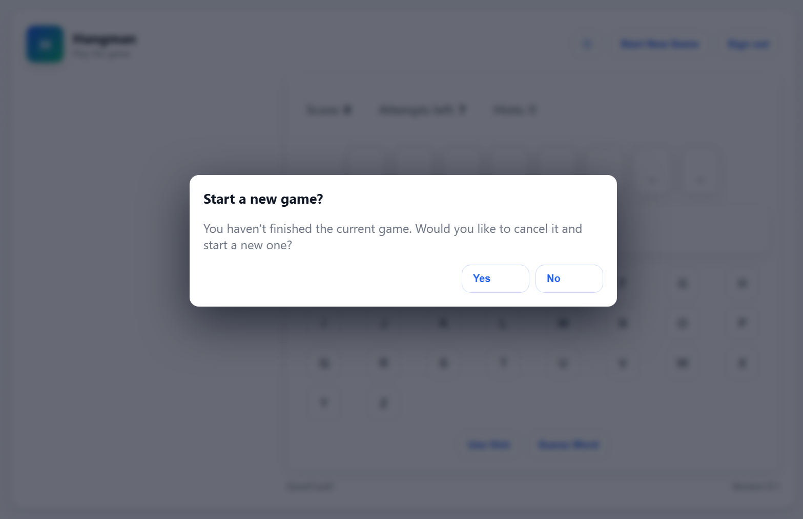](img/testing/frontend/28.png)                                                                                                                                                                             | Yes     |
| TC032        | Clicking “No” to return to the current game.                                                              | When the user clicks “No”, they should be able to continue with the current game.                                                                                                                                                                                                                                                                                                 | When the user clicks “No”, they are able to continue with the current game.                                                                                                                                                                                                                                                       | [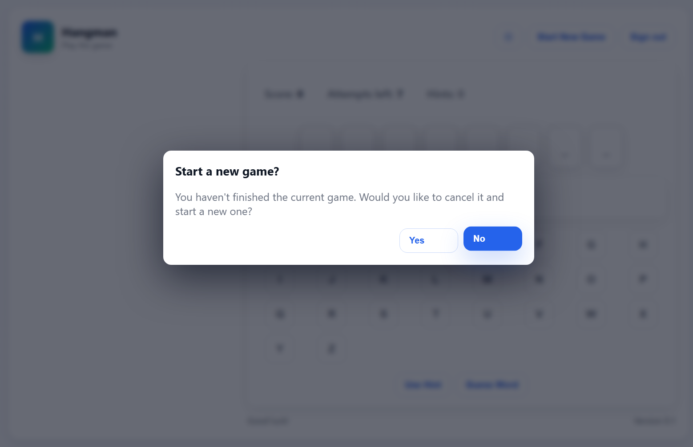](img/testing/frontend/29.png), [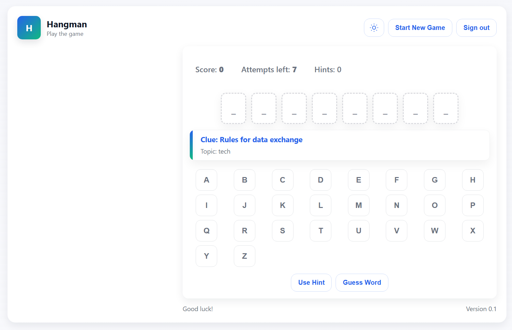](img/testing/frontend/30.png)                                                                                       | Yes     |
| TC033        | Clicking “Yes” to start new game                                                                          | When the user clicks “Yes” to start new game, they should get a drop down menu of the game difficulty options and after selecting they should be able to start a new game.                                                                                                                                                                                                        | When the user clicks “Yes” to start new game, they get a drop down menu of the game difficulty options and after selecting they are able to start a new game.                                                                                                                                                                     | [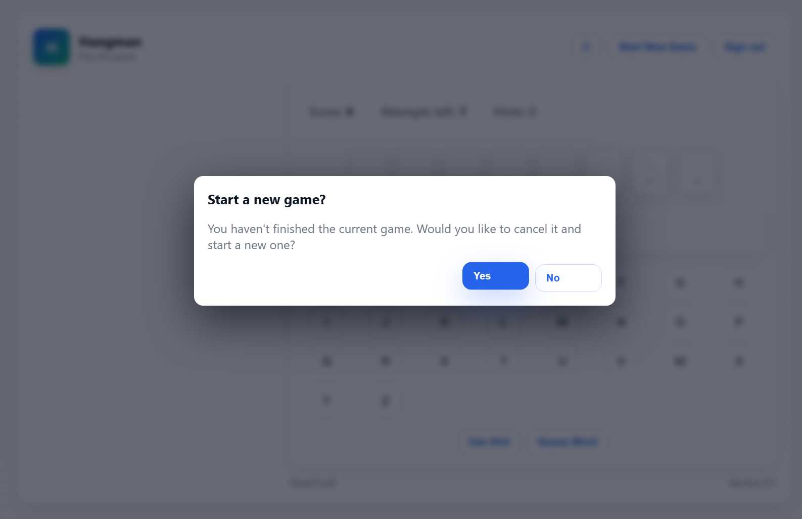](img/testing/frontend/31.png), [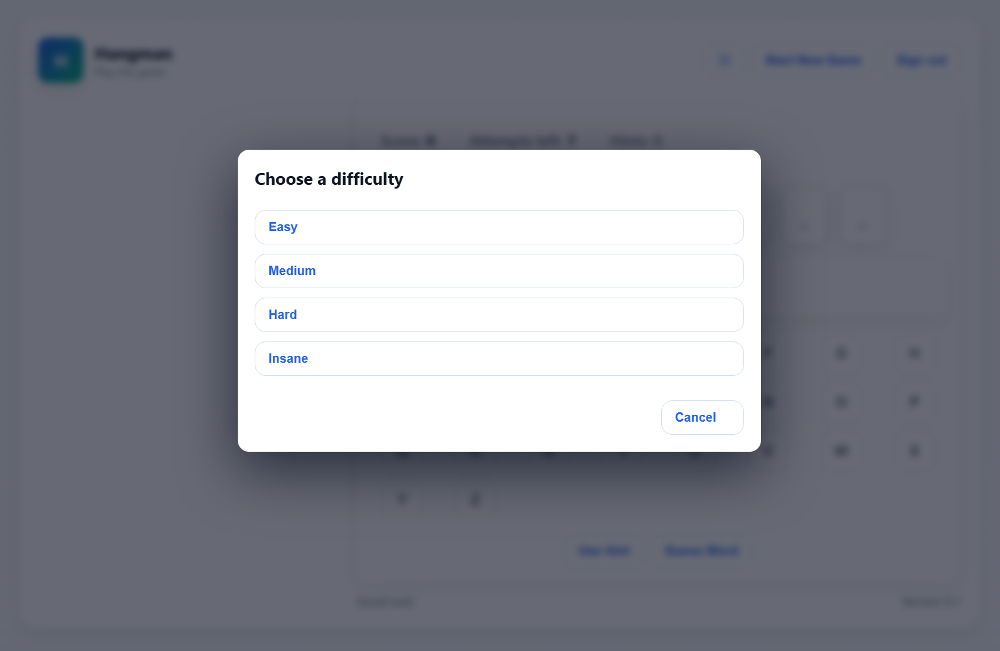](img/testing/frontend/32.png), [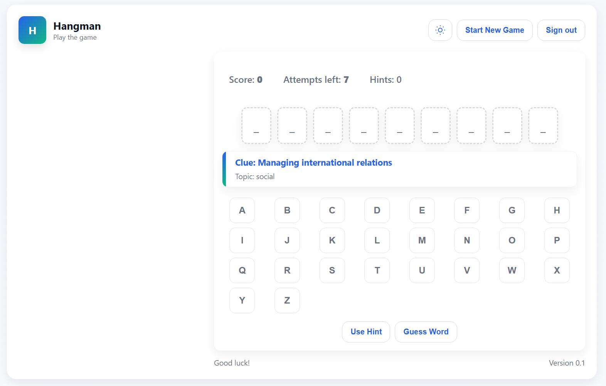](img/testing/frontend/33.png) | Yes     |
| TC034        | The user guess the word correctly and get a congratulations message.                                      | When the user guesses the word correctly, they are supposed to get this message "You Won! Congratulations — you won!"                                                                                                                                                                                                                                                             | When the user guesses the word correctly, they are get this message "You Won! Congratulations — you won!"                                                                                                                                                                                                                         | [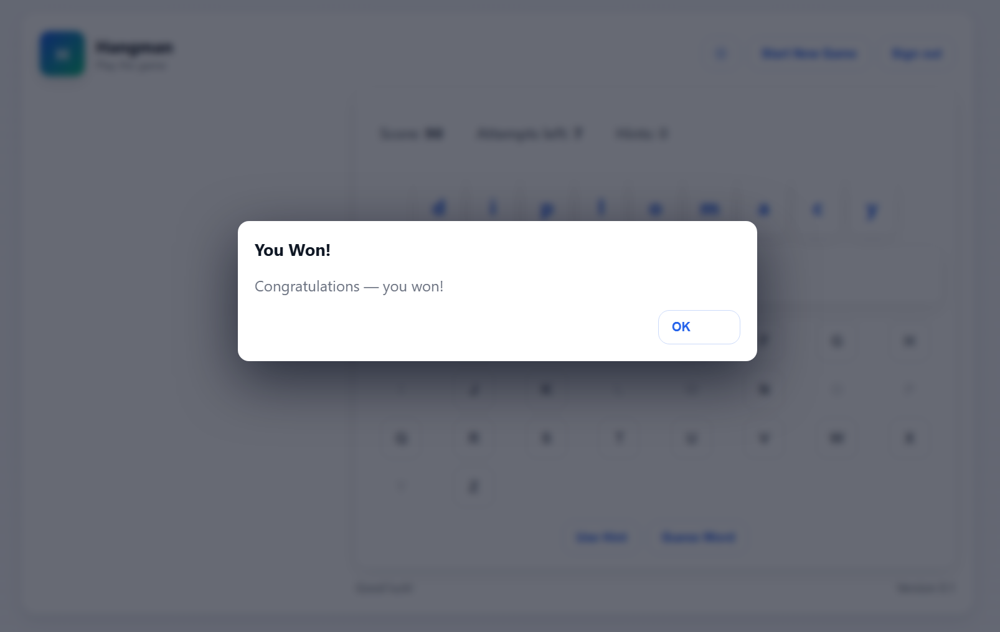](img/testing/frontend/34.png)                                                                                                                                                                             | Yes     |
| TC035        | The user does not guess the word and loses and gets a game lost message                                   | The user fails to guess the word and they lose the game and they should get this message “Game Over Game over — you lost. Hint: hint, topic: topic”                                                                                                                                                                                                                               | The user fails to guess the word and they lose the game and they get this message “Game Over Game over — you lost. Hint:  topic: ”.                                                                                                                                                                                               | [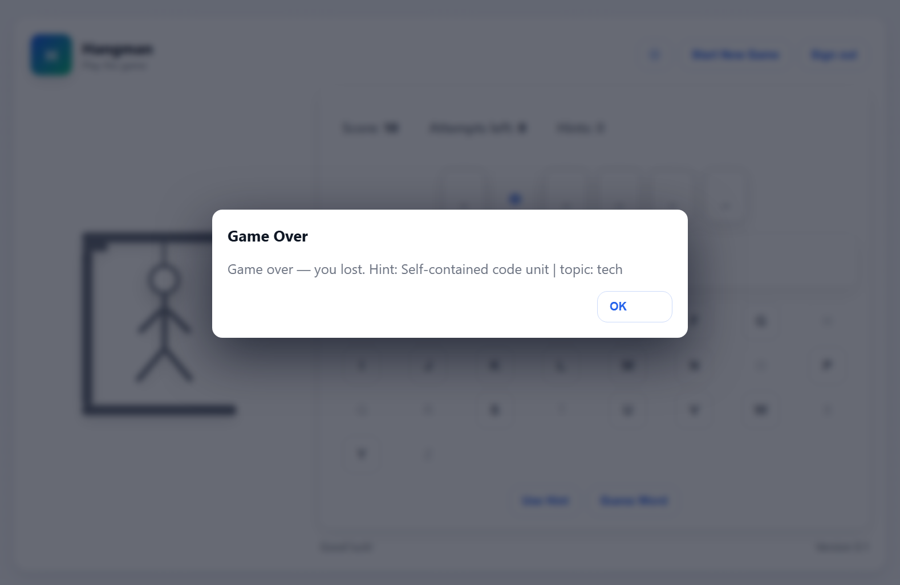](img/testing/frontend/35.png), [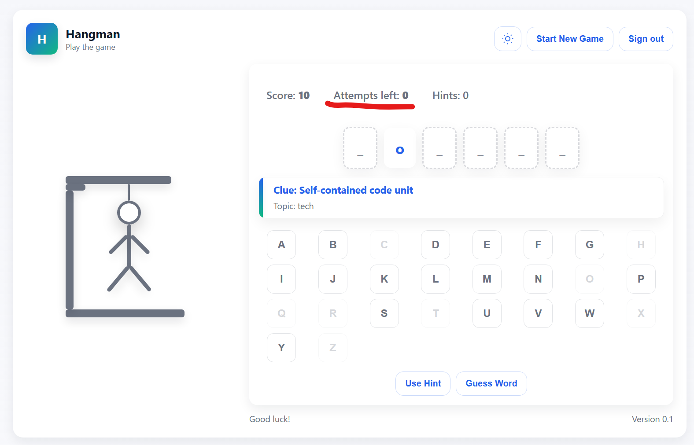](img/testing/frontend/36.png)                                                                                       | Yes     |
| TC036        | User getting the option to resume game when signing back in                                               | When the user signs back in, they should get a message saying “Resume previous game? You have an unfinished game. Would you like to resume it? ” and that gives them a choice to resume the current game or no.                                                                                                                                                                   | When the user signs back in, they get a message saying “Resume previous game? You have an unfinished game. Would you like to resume it? ” and that gives them a choice to resume the current game or no.                                                                                                                          | [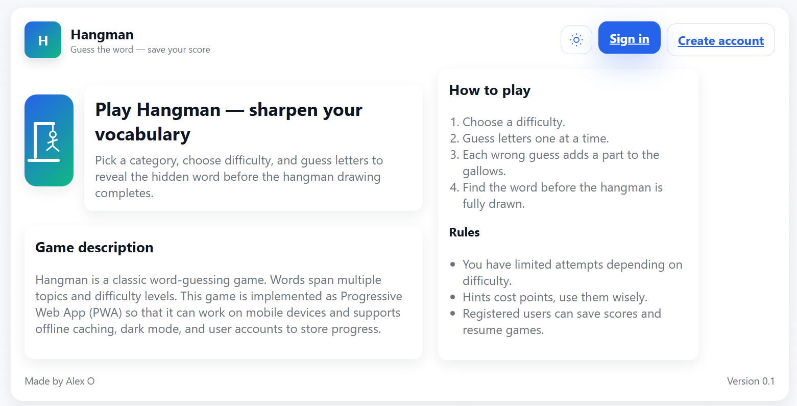](img/testing/frontend/37.png), [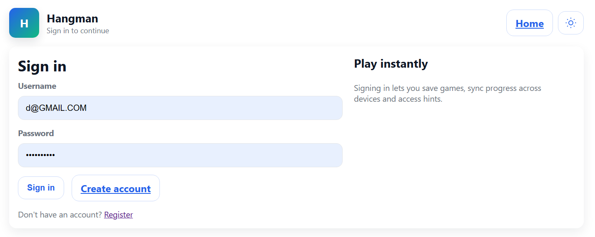](img/testing/frontend/38.png), [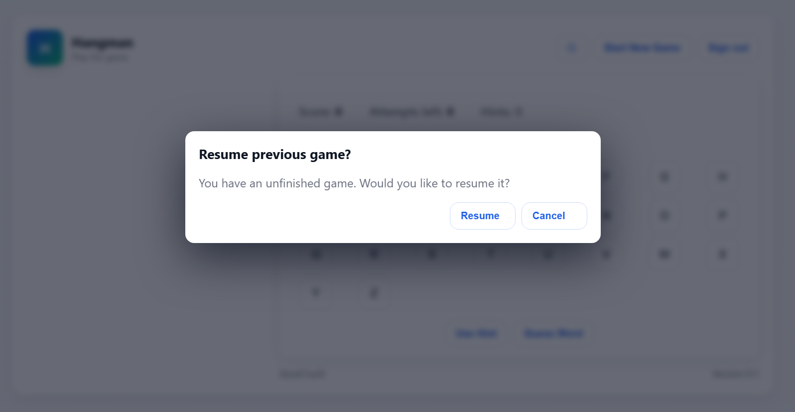](img/testing/frontend/39.png) | Yes     |
| TC037        | User clicks “Cancel” to not resume current game.                                                          | When the user clicks “Cancel”, the current game does not resume and they should be able to start a new game.                                                                                                                                                                                                                                                                      | When the user clicks “Cancel”, the current game does not resume and they are able to start a new game.                                                                                                                                                                                                                            | [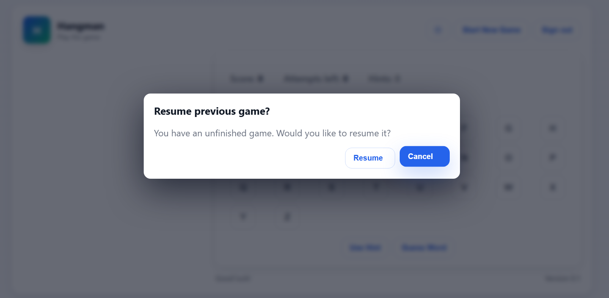](img/testing/frontend/40.png), [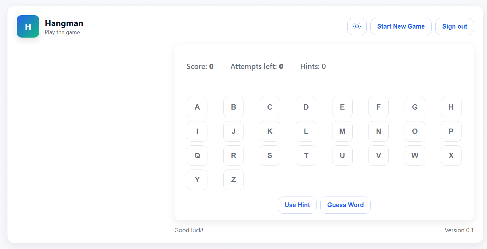](img/testing/frontend/41.png)                                                                                       | Yes     |
| TC038        | User clicks “Resume” to resume the current game.                                                          | When the user clicks “Resume”, they should be able to continue with the current game.                                                                                                                                                                                                                                                                                             | When the user clicks “Resume”, they are able to continue with the current game.                                                                                                                                                                                                                                                   | [](img/testing/frontend/42.png), [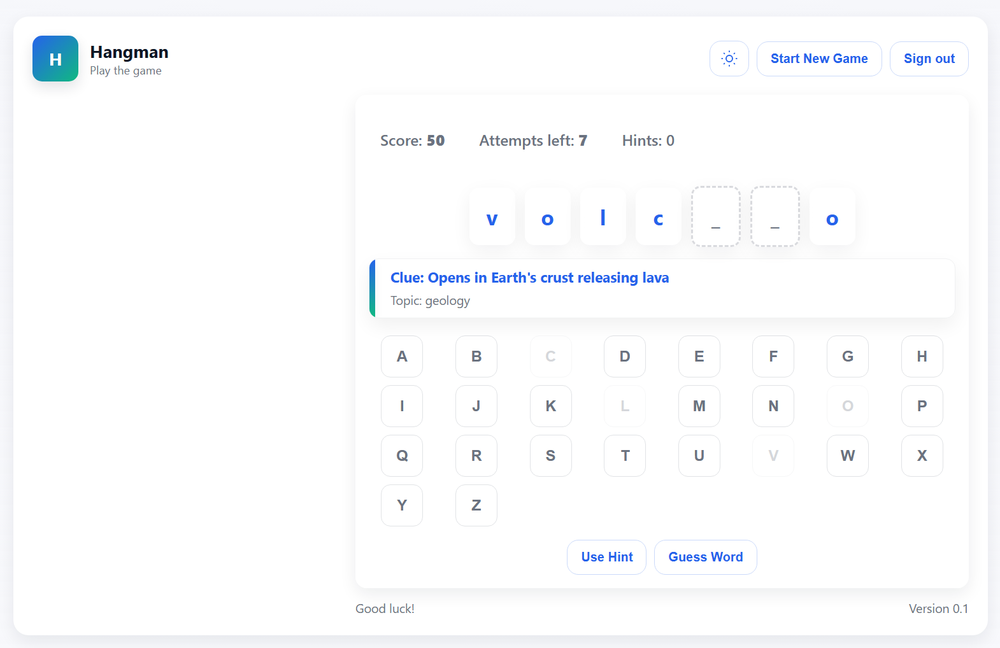](img/testing/frontend/43.png)                                                                                       | Yes     |
| TC039        | Testing to ensure that the already guessed letters are not clickable.                                     | When the user has attempted to guess any letters, they should become unclickable.                                                                                                                                                                                                                                                                                                 | When the user has attempted to guess any letters, they become unclickable.                                                                                                                                                                                                                                                        | [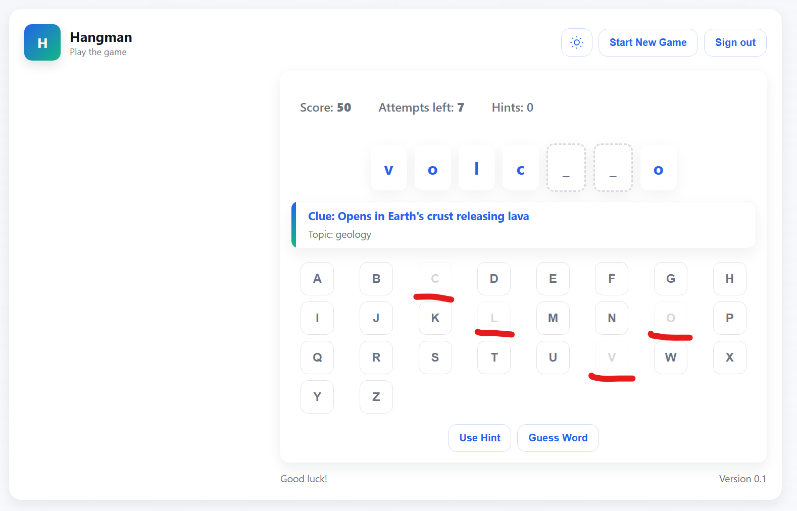](img/testing/frontend/44.png)                                                                                                                                                                             | Yes     | 
| TC040        | Testing to ensure that letter placeholders are rendered correctly when the user starts a new game.        | When the user starts a new game, the letter placeholders should be rendered correctly neatly in one line.                                                                                                                                                                                                                                                                         | When the user starts a new game, the letter placeholders are rendered correctly neatly in one line.                                                                                                                                                                                                                               | [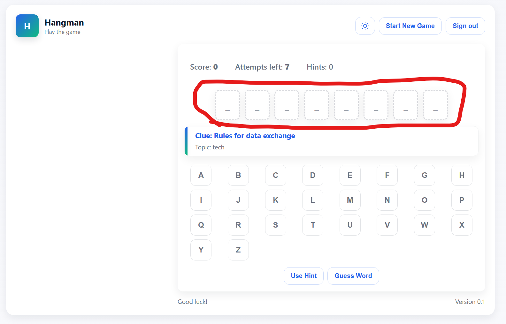](img/testing/frontend/45.png)                                                                                                                                                                             | Yes     |
| TC041        | Testing to ensure that when new game is started, the alphabet is rendered correctly in the correct order. | When the user starts a new game,the alphabet should be rendered correctly in the correct order.                                                                                                                                                                                                                                                                                   | When the user starts a new game,the alphabet is rendered correctly in the correct order.                                                                                                                                                                                                                                          | [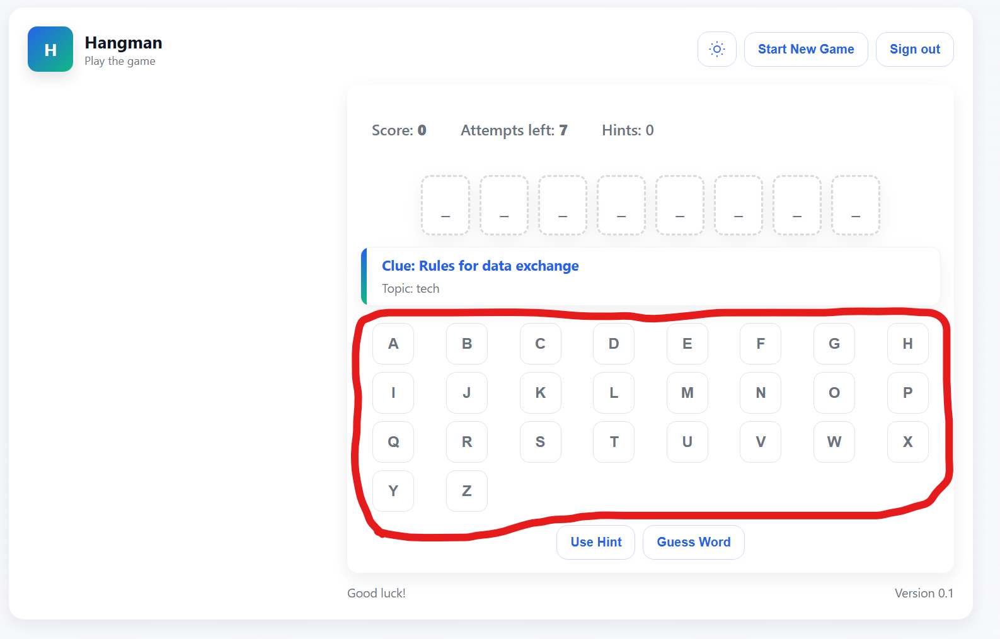](img/testing/frontend/46.png)                                                                                                                                                                             | Yes     |
| TC042        | Testing to ensure that when wrong guess is made, the number of attempts left decreases by one each time.  | When the user makes a wrong guess, the number of attempts left should decrease by 1 each time.                                                                                                                                                                                                                                                                                    | When the user makes a wrong guess, the number of attempts left decreases by 1 each time.                                                                                                                                                                                                                                          | [](img/testing/frontend/47.png), [](img/testing/frontend/48.png)                                                                                       | yes     |
| TC043        | Testing to ensure that 10 points is earned after correct guess  is made                                   | When the user makes a correct guess, they should earn 10 points for each correct guess.                                                                                                                                                                                                                                                                                           | When the user makes a correct guess, they earn 10 points for each correct guess.                                                                                                                                                                                                                                                  | [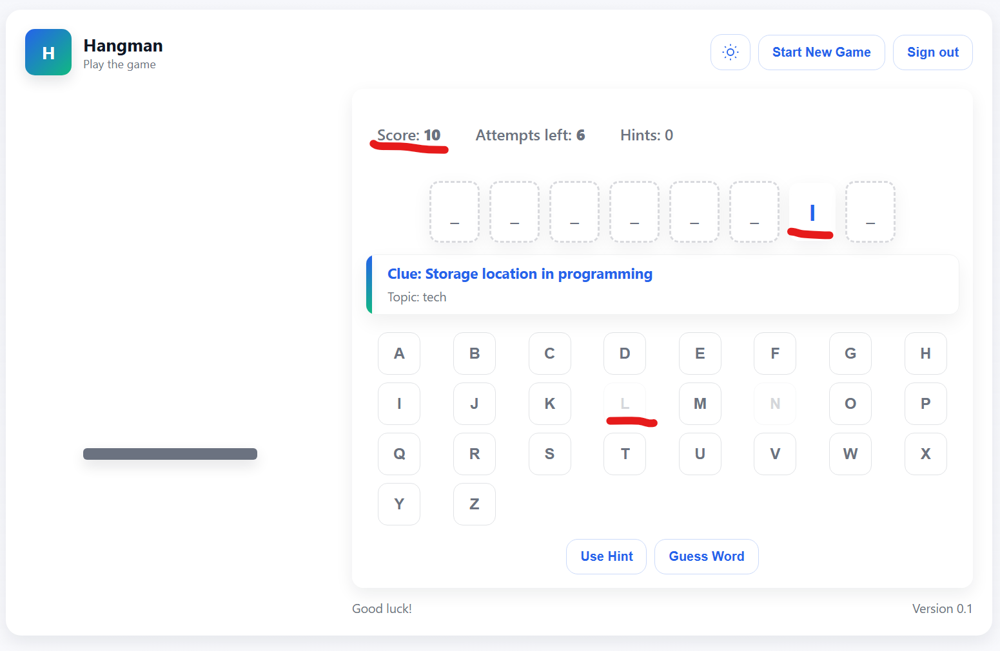](img/testing/frontend/49.png)                                                                                                                                                                             | Yes     |
| TC044        | Testing to ensure that when new game s started, Clue and Topic panel are rendered correctly.              | When the user starts a new game, the clue and topic panel should be rendered correctly under the letter placeholders.                                                                                                                                                                                                                                                             | When the user starts a new game, the clue and topic panel are rendered correctly under the letter placeholders.                                                                                                                                                                                                                   | [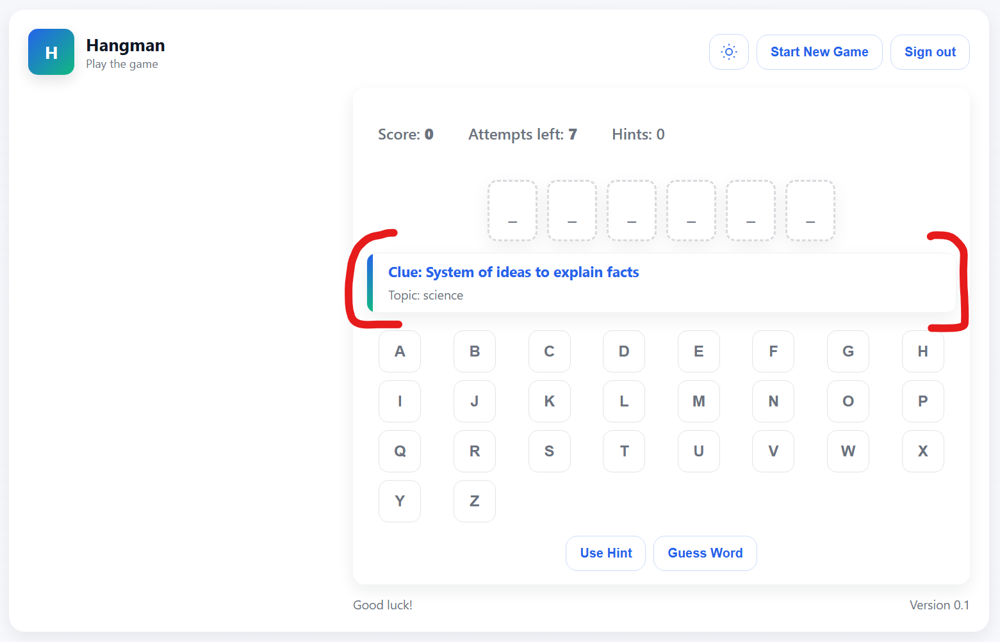](img/testing/frontend/50.png)                                                                                                                                                                             | Yes     |
| TC045        | Clicking “Use Hint” button when user is signed in but no active game.                                     | When the user is signed in and attempts to click the “Use Hint” button when there is no active game, the user is supposed to receive the message “Notification - You must start a game to use a hint.”.                                                                                                                                                                           | When the user is signed in and attempts to click the “Use Hint” button when there is no active game, the user receives the message “Notification - You must start a game to use a hint.”.                                                                                                                                         | [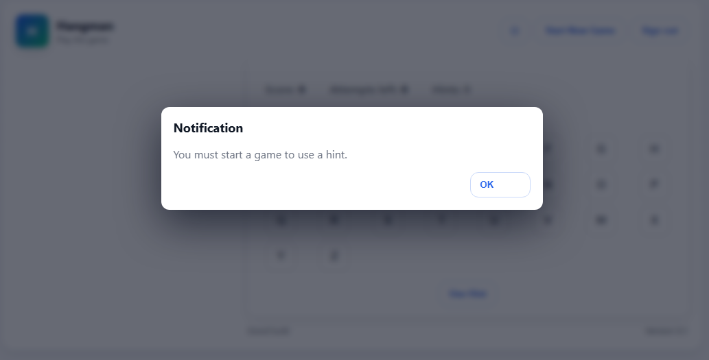](img/testing/frontend/51.png)                                                                                                                                                                             | Yes     |
| TC046        | Clicking “Use Hint” when the game is over.                                                                | When the game is over and the word has been fully guessed and the user still attempts to click “Use Hint” button, they are supposed to get this message “Notification - You can only use hints in an active game.”                                                                                                                                                                | When the game is over and the word has been fully guessed and the user still attempts to click “Use Hint” button, they get this message “Notification - You can only use hints in an active game.”.                                                                                                                               | [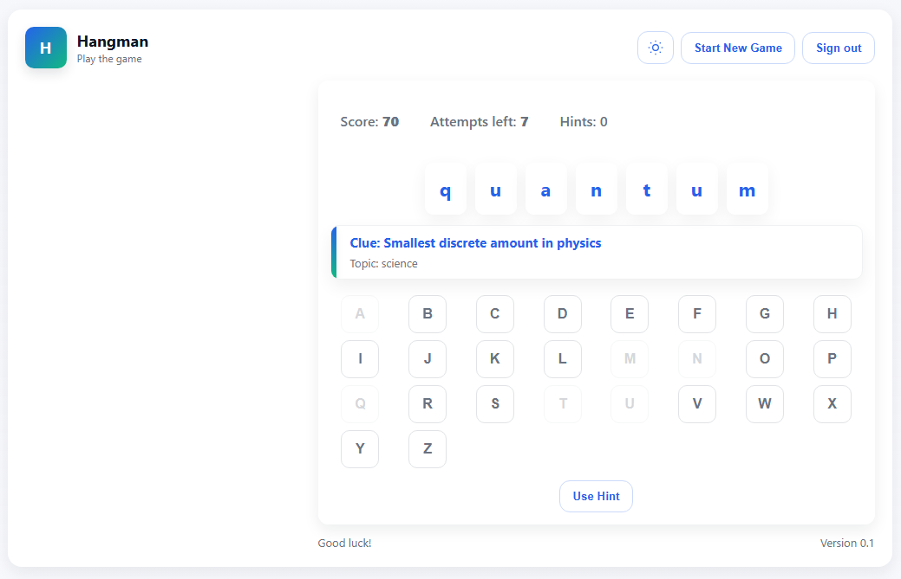](img/testing/frontend/52.png), [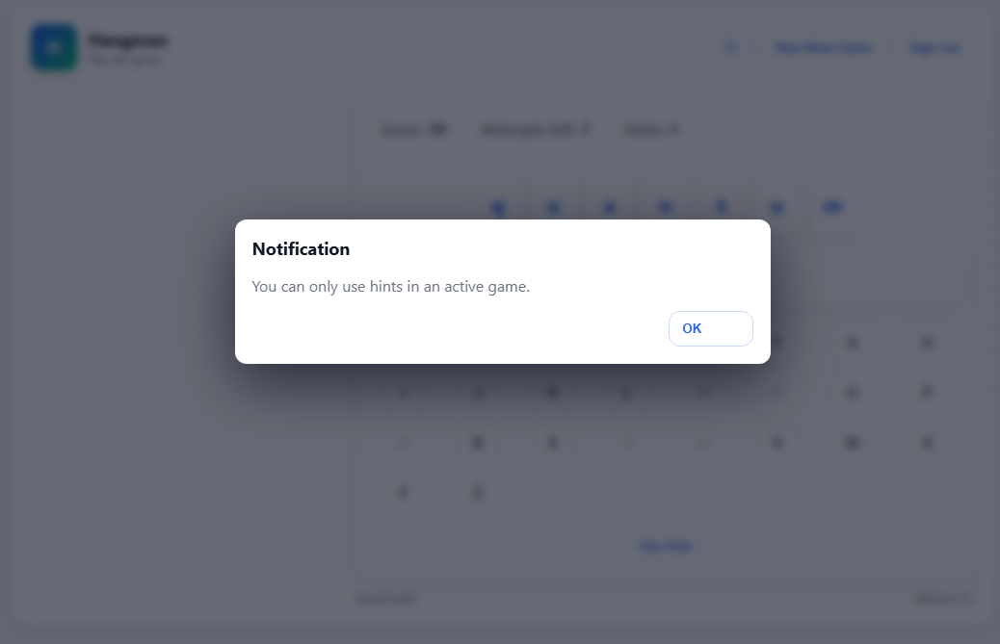](img/testing/frontend/53.png)                                                                                       | Yes     |
| TC047        | Testing the use of “Use Hint” button in the game.                                                         | When the game is active and the user clicks “Use Hint”, a letter is supposed to be revealed, the score is supposed to be decreased by 10, Hints is supposed to increase by 1.                                                                                                                                                                                                     | When the game is active and the user clicks “Use Hint”, a letter revealed, the score is decreased by 10, Hints is increased by 1.                                                                                                                                                                                                 | [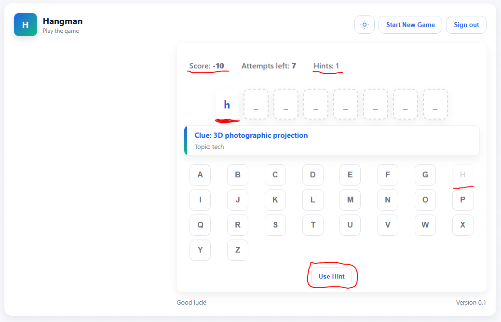](img/testing/frontend/54.png)                                                                                                                                                                             | Yes     |


## Backend Testing

### Unit Testing Plan and Test Cases

Provided below is the unit testing plan and test cases for the backend of the Hangman game:

| Test Case ID | Test Description                        | Steps to Reproduce                                                                 | Expected Result                                               | Actual Result                                                                | Pass/Fail |
|--------------|-----------------------------------------|-----------------------------------------------------------------------------------|---------------------------------------------------------------|------------------------------------------------------------------------------|-----------|
| BTC001       | Test user registration endpoint         | 1. Send POST request to /register with valid user data<br>2. Check response status and body | Response status is 200 and user data is returned                              | User registration works correctly | Passed    |
| BTC002       | Test user login endpoint                | 1. Send POST request to /login with valid credentials<br> 2. Check response status and body | Response status is 200 and token is returned                                 | User login works correctly | Passed    |
| BTC003       | Test start new game endpoint            | 1. Send POST request to /start_game with valid user token<br>2. Check response status and body | Response status is 200 and game data is returned                             | Start new game works correctly            | Passed    |
| BTC004       | Test submit guess endpoint              | 1. Send POST request to /submit_guess with valid game ID and letter<br>2. Check response status and body | Response status is 200 and updated game state is returned                    | Submit guess works correctly              | Passed    |
| BTC005       | Test get game state endpoint            | 1. Send GET request to /game_state with valid game ID<br>2. Check response status and body | Response status is 200 and current game state is returned                    | Get game state works correctly            | Passed    |
| BTC006       | Test scoring system                     | 1. Simulate correct and incorrect guesses<br>2. Check if score updates correctly | Score updates as expected after each guess                                   | Scoring system works correctly            | Passed    |
| BTC007       | Test hint functionality                 | 1. Send POST request to /use_hint with valid game ID<br>2. Check response status and body | Response status is 200 and a letter is revealed with score deduction         | Hint functionality works correctly        | Passed    |
| BTC008       | Test user authentication middleware     | 1. Send requests with and without valid tokens<br>2. Check if access is granted or denied appropriately | Requests with valid tokens are granted access; invalid tokens are denied     | Authentication middleware works correctly | Passed    |
| BTC009       | Test error handling                     | 1. Send invalid requests to various endpoints<br>2. Check if appropriate error responses are returned | Appropriate error messages and status codes are returned for invalid requests | Error handling works correctly            | Passed    |

### Unit Test Results

The unit tests for the backend of the Hangman game were executed using the pytest framework.
The tests covered various functionalities including user registration, login, game state management, scoring, and hint functionality.
All test cases passed successfully, indicating that the backend components are functioning as expected.

**Test evidence screenshots:**

Authentication flow test:

[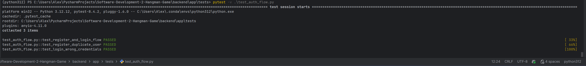](img/testing/backend/auth_flow.png)

CRUD operations test:

[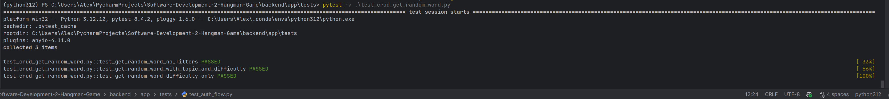](img/testing/backend/crud_testing.png)

Game endpoints test:

[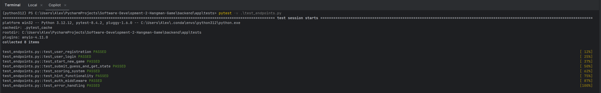](img/testing/backend/endpoints_testing.png)


## Accessibility Testing

The accessibility testing for the Hangman game was conducted using the contrast_check.py script in the scripts folder.
This script checks the color contrast ratios of various elements in the application to ensure they meet accessibility standards.
The test results indicate that all color combinations used in the application meet the required contrast ratios for both normal text and large text.
[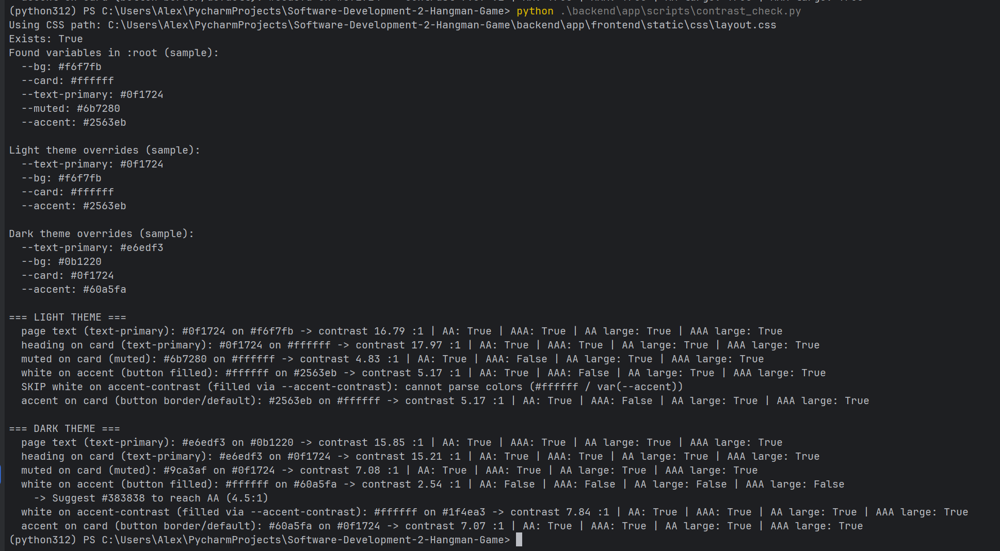](img/testing/accessibility/test_result.png)


## Performance Testing

### index.html

It can be seen the loading time for `index.html` is quite fast as it loads in under 1 second:
[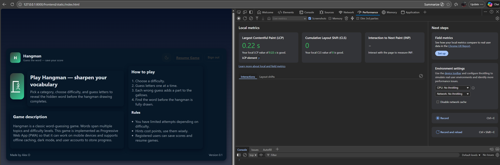](img/testing/performance/perf0.png)

### login.html

The loading time for `login.html` is also quite fast as it loads in under 1 second:
[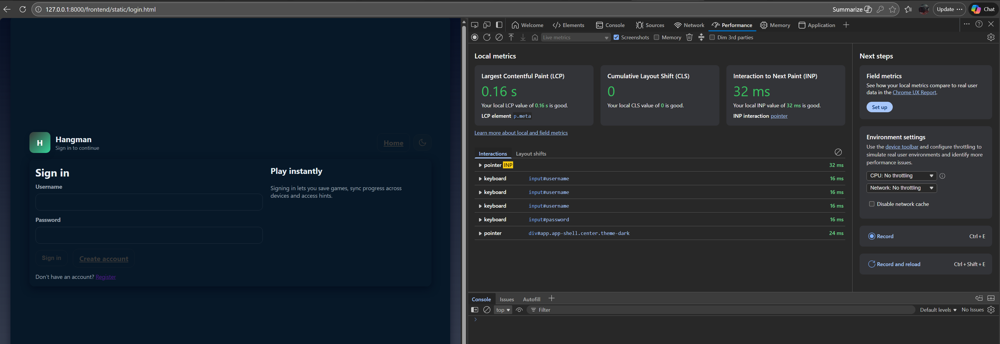](img/testing/performance/perf2.png)

### register.html

The loading time for `register.html` is also fast as it loads in under 1 second:
[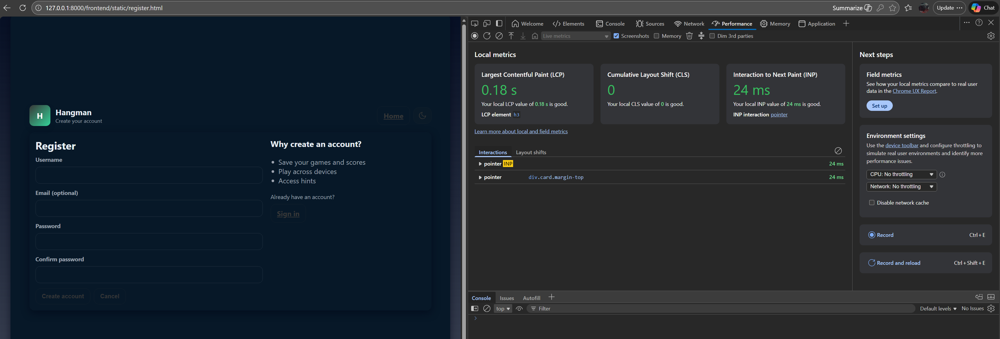](img/testing/performance/perf3.png)

### game.html

This is the most content-heavy page and its loading time is around 330 ms which is still perfectly acceptable:
[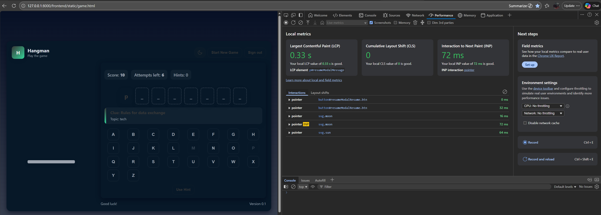](img/testing/performance/perf1.png)

Summary: Overall, the performance testing indicates that all pages of the Hangman game load quickly and efficiently, providing a smooth user experience.

## Example Bug Fixes

### Bug 1: Schema Migration Issue When Adding 'hints_used' Column

**Issue**: When adding a new column `hints_used` to the existing `games` table, the backend REST API responses haven't been updated to include this new column hence schema validation failed.

**Fix**: Updated the models, CRUD operations and backend responses to include the `hints_used` field. Also, ensured that the database migration script correctly adds the new column to the existing table without data loss.

**Solution**: After updating the models, CRUD operations and backend responses, the schema validation passed successfully and the API responses included the new `hints_used` field as expected.

Example log output showing the exception being raised before the fix:

INFO:     127.0.0.1:58114 - "POST /api/games/new HTTP/1.1" 500 Internal Server Error
ERROR:    Exception in ASGI application
Traceback (most recent call last):
  File "C:\Users\Alex\.conda\envs\python312\Lib\site-packages\uvicorn\protocols\http\httptools_impl.py", line 409, in run_asgi
    result = await app(  # type: ignore[func-returns-value]
             ^^^^^^^^^^^^^^^^^^^^^^^^^^^^^^^^^^^^^^^^^^^^^^
  File "C:\Users\Alex\.conda\envs\python312\Lib\site-packages\uvicorn\middleware\proxy_headers.py", line 60, in __call__
    return await self.app(scope, receive, send)
           ^^^^^^^^^^^^^^^^^^^^^^^^^^^^^^^^^^^^
  File "C:\Users\Alex\.conda\envs\python312\Lib\site-packages\fastapi\applications.py", line 1134, in __call__
    await super().__call__(scope, receive, send)
  File "C:\Users\Alex\.conda\envs\python312\Lib\site-packages\starlette\applications.py", line 113, in __call__
    await self.middleware_stack(scope, receive, send)
  File "C:\Users\Alex\.conda\envs\python312\Lib\site-packages\starlette\middleware\errors.py", line 186, in __call__
    raise exc
  File "C:\Users\Alex\.conda\envs\python312\Lib\site-packages\starlette\middleware\errors.py", line 164, in __call__
    await self.app(scope, receive, _send)
  File "C:\Users\Alex\.conda\envs\python312\Lib\site-packages\starlette\middleware\exceptions.py", line 63, in __call__
    await wrap_app_handling_exceptions(self.app, conn)(scope, receive, send)
  File "C:\Users\Alex\.conda\envs\python312\Lib\site-packages\starlette\_exception_handler.py", line 53, in wrapped_app
    raise exc
  File "C:\Users\Alex\.conda\envs\python312\Lib\site-packages\starlette\_exception_handler.py", line 42, in wrapped_app
    await app(scope, receive, sender)
  File "C:\Users\Alex\.conda\envs\python312\Lib\site-packages\fastapi\middleware\asyncexitstack.py", line 18, in __call__
    await self.app(scope, receive, send)
  File "C:\Users\Alex\.conda\envs\python312\Lib\site-packages\starlette\routing.py", line 716, in __call__
    await self.middleware_stack(scope, receive, send)
  File "C:\Users\Alex\.conda\envs\python312\Lib\site-packages\starlette\routing.py", line 736, in app
    await route.handle(scope, receive, send)
  File "C:\Users\Alex\.conda\envs\python312\Lib\site-packages\starlette\routing.py", line 290, in handle
    await self.app(scope, receive, send)
  File "C:\Users\Alex\.conda\envs\python312\Lib\site-packages\fastapi\routing.py", line 125, in app
    await wrap_app_handling_exceptions(app, request)(scope, receive, send)
  File "C:\Users\Alex\.conda\envs\python312\Lib\site-packages\starlette\_exception_handler.py", line 53, in wrapped_app
    raise exc
  File "C:\Users\Alex\.conda\envs\python312\Lib\site-packages\starlette\_exception_handler.py", line 42, in wrapped_app
    await app(scope, receive, sender)
  File "C:\Users\Alex\.conda\envs\python312\Lib\site-packages\fastapi\routing.py", line 111, in app
    response = await f(request)
               ^^^^^^^^^^^^^^^^
  File "C:\Users\Alex\.conda\envs\python312\Lib\site-packages\fastapi\routing.py", line 413, in app
    content = await serialize_response(
              ^^^^^^^^^^^^^^^^^^^^^^^^^
  File "C:\Users\Alex\.conda\envs\python312\Lib\site-packages\fastapi\routing.py", line 254, in serialize_response
    raise ResponseValidationError(
fastapi.exceptions.ResponseValidationError: 1 validation errors:
  {'type': 'missing', 'loc': ('response', 'hints_used'), 'msg': 'Field required', 'input': {'id': 64, 'revealed': '________', 'initial_attempts': 7, 'attempts_left': 7, 'score': 0, 'state': 'active', 'guessed': '', 'word': {'id': 248, 'clue': 'Reusable block of code', 'topic': 'tech', 'difficulty': 'medium'}}}

### Bug 2: One letter being guessed correctly and then clicked again and again leads to score being adding up more and more:

**Issue**: When a letter is guessed correctly, the score increases by 10 points. However, if the user clicks the same letter multiple times after it has already been guessed correctly, the score continues to increase by 10 points each time.

**Fix**: Added a check to see if the letter has already been guessed before updating the score. If the letter has already been guessed, the score is not updated again. Also updated the frontend to disable letters that have already been guessed to prevent further clicks.

**Solution**: After implementing the fix, the score only increases by 10 points the first time a letter is guessed correctly. Subsequent clicks on the same letter do not affect the score. Also, the frontend disables letters that have already been guessed to prevent further clicks.

Issue screenshot before the fix reproducing the bug:

[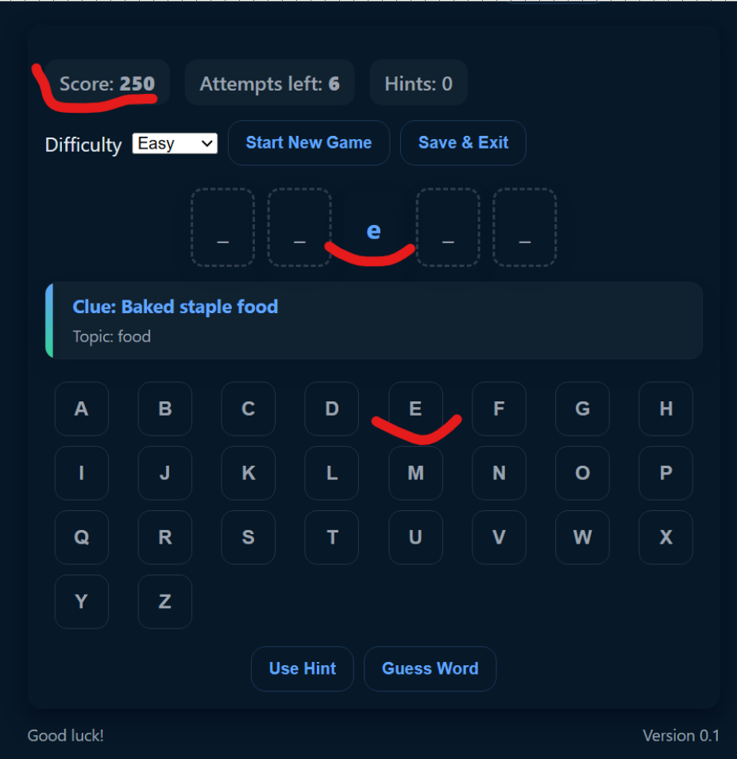](img/testing/bugfixes/bug1_before.png)

### Bug 3: When clicking Resume button the backend doesn’t check game state and just returns even the game which is already won/lost:

**Issue**: When the user clicks the "Resume" button to continue a previous game, the backend does not check the current state of the game. As a result, it returns the game data even if the game has already been won or lost.

**Fix**: Updated the backend logic to check the game state before returning the game data. If the game state is "won" or "lost", the backend now returns an appropriate message indicating that the game cannot be resumed.

**Solution**: After implementing the fix, when the user clicks the "Resume" button, the backend checks the game state. If the game has already been won or lost, the user receives a message indicating that the game cannot be resumed.

Issue screenshot before the fix reproducing the bug:

[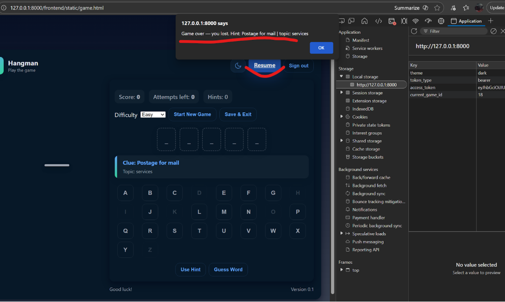](img/testing/bugfixes/bug2_before.png)

### Bug 4: When clicking Resume button some previously won game is returned back by frontend and the word is shown and then immediately game is lost

**Issue**: When the user clicks the "Resume" button, sometimes a previously won game is returned by the frontend. The word is displayed, and then immediately the game is marked as lost.

**Fix**: Investigated the issue and found that the frontend was not properly handling the game state returned by the backend. Updated the frontend logic to correctly interpret the game state and prevent displaying a previously won game as active.

**Solution**: After implementing the fix, when the user clicks the "Resume" button, the frontend correctly handles the game state. If the game has already been won, it does not display the word or mark the game as lost.

Issue screenshot before the fix reproducing the bug:

[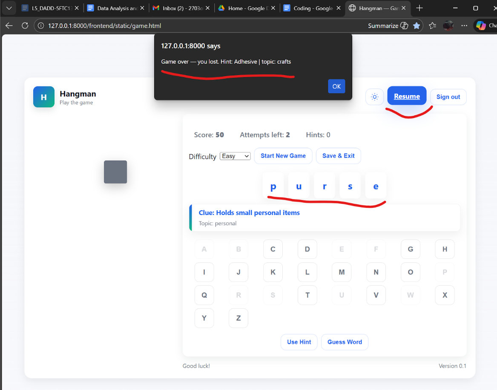](img/testing/bugfixes/bug3_before.png)

---

# Deployment Instructions

Because the application consists of both a backend (FastAPI) and a frontend (HTML, CSS, JS), the deployment involves setting up a web server to host the FastAPI app and serve the static frontend files.
Above means our app can't be deployed on GitHub Pages as it only serves static files.

I've decided to deploy my Hangman game app using Render.com which offers free hosting for web apps with easy deployment from GitHub repositories.
Here are the steps to deploy the application on Render.com:
1. **Create a Render.com Account**: Sign up for a free account on Render.com if you don't have one already. You can also sign in using GitHub credentials.
2. **Connect GitHub Repository**: Link your Render.com account to your GitHub account and select the repository containing your crossword game code.
3. **Create a New Web Service**:
   - Click on "New" and select "Web Service".
   - Choose the repository and branch you want to deploy.
4. **Configure Build Settings**:
   - Set the build command to install dependencies, e.g. `pip install -r requirements.txt`.
   - Set the start command to run the FastAPI app, e.g. `uvicorn backend.app.main:app` (assuming your FastAPI app is in `main.py`).
5. **Set Environment Variables**: If your app requires any environment variables (e.g. for secret keys), set them in the Render.com dashboard.
6. **Deploy**: Click "Create Web Service" to start the deployment process. Render.com will build and deploy your app.
7. **Access Your App**: Once deployed, Render.com will provide you with a URL where your crossword game can be accessed.

I've followed the above steps and successfully deployed my Hangman game app on Render.com under the following URL:
[https://hangman-game-project.onrender.com/](https://hangman-game-project.onrender.com/)

Because I use free hosting plan on Render.com there might be some delay (a few seconds) when accessing the app for the first time after a period of inactivity as the server might go to sleep mode.

Here is how the deployment looks like on Render.com when the web service is deployed successfully:

[](img/render.png)

As the frontend is served as static files by FastAPI, there is no separate deployment step for the frontend.

--- 

# Instructions to install the Hangman Game as Progressive Web App (PWA) on mobile and tablet devices

To install Progressive Web App (PWA) version of the Hangman game on your device, follow these steps:
1. **Open the Hangman Game in a Supported Browser**: Use a modern web browser that supports PWA installation, such as Google Chrome, Microsoft Edge, or Firefox. Navigate to the URL of the Hangman game (e.g., ``).

[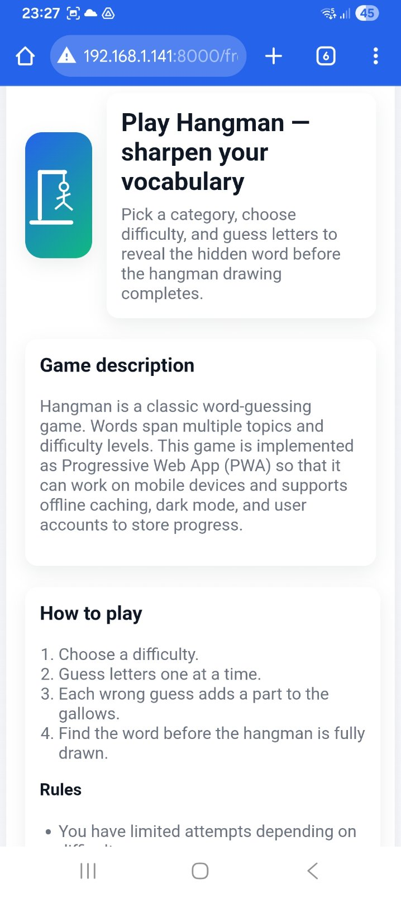](img/pwa/pwa_opened.jpg)

2. **Look for the Install Prompt**: Depending on your browser, you may see an install prompt in the address bar or a pop-up asking if you want to install the app. In Chrome, this is usually represented by a "+" icon in the address bar.

[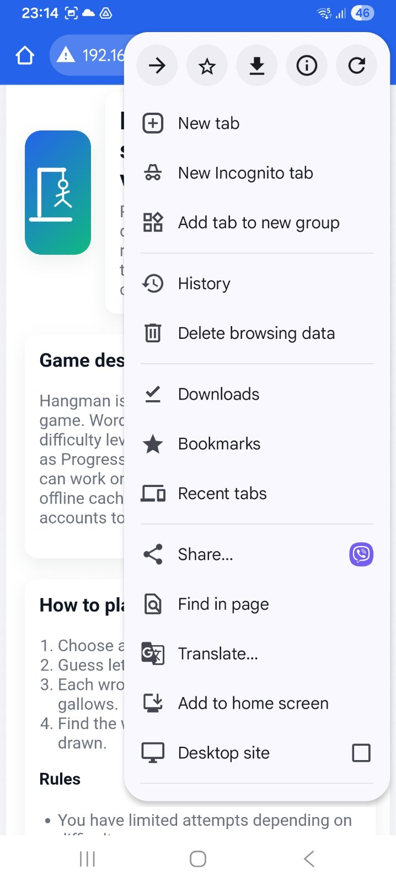](img/pwa/pwa_add_home_screen.jpg)

3. **Click the Install Button**: Click on the install prompt or the "+" icon. This will open a dialog box asking for confirmation to install the app.

[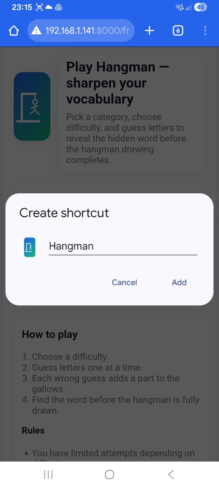](img/pwa/pwa_add_app.jpg)

4. **Confirm Installation**: Click "Install" or "Add" in the dialog box to confirm the installation. The Hangman game will be installed on your device.

[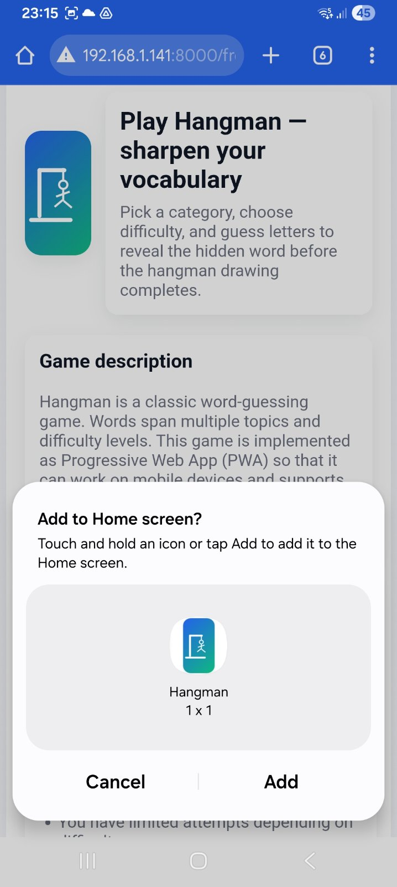](img/pwa/pwa_adding_conf.jpg)

5. **Access the Installed App**: Once installed, you can access the Hangman game from your device's home screen (on mobile devices) or from the applications menu (on desktop).

[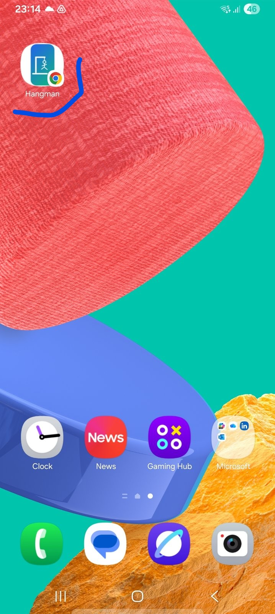](img/pwa/pwa_installed.jpg)


--- 

# An evaluation of how well my project met each of the requirements together with a statement of the project’s overall success and/or failure

## Evaluation of Project Requirements

The main project requirement for the Hangman game as per the assignment specification was to create a mobile friendly game.
I've chosen to implement the Hangman game app.
Here is an evaluation of how well my project met each of the requirements:
1. I've successfully accomplished all of the project activities covering requirements/creative session, design and analysis session, coding, testing and final report writing in the form of this README.md file.
2. The Hangman game app is fully functional and meets the core requirements of the game including user registration, login, gameplay, game state management, scoring, and hint functionality.
3. The frontend is designed to be mobile-friendly and responsive, ensuring a good user experience across different devices.
4. The backend is implemented using FastAPI, providing a robust and scalable architecture for the game.
5. Comprehensive testing has been conducted including frontend testing, backend unit testing, accessibility testing, and performance testing.
6. The project has been successfully deployed on Render.com, making it accessible to users online.
7. The project documentation includes detailed deployment instructions, PWA installation guide, and an evaluation of the project requirements.
8. As per Activity 5 I've gathered and documented evidence from ALL of my project’s activities and outcomes in this README.md file.

## Overall Success of the Project

Overall, I consider the Hangman game project to be a success.
The project met all the specified requirements and delivered a fully functional and engaging game experience. 
It has to be mentioned that on top of successfully delivering all of the MVP features I've also implemented some additional features from Phase 2 backlog being: difficulty levels, accessibility features, responsive design, progress saving, light and dark themes.
The mobile-friendly design ensures that users can enjoy the game on various devices, and the backend implementation using FastAPI framework provides a solid foundation for future enhancements.
The comprehensive testing and documentation further contribute to the project's success, ensuring that it is well-prepared for deployment and user access.
While there were some challenges encountered during development, such as bug fixes and schema migrations, these were effectively addressed, resulting in a polished and well tested and stable final game app.
The successful deployment on Render.com demonstrates the project's readiness for real-world use, and the PWA installation guide adds value for users who wish to install the game on their devices.
In conclusion, the Hangman game app development project has achieved its objectives in full.

---

# References


1. Willard, W., 2013. HTML: A Beginner’s Guide (5th ed.). New York: McGraw-Hill. Available at: HTML: https://learning.oreilly.com/library/view/html-a-beginners/9780071809276/?sso_link=yes&sso_link_from=UnivofHerts
2. Wolf, Jürgen 2025. HTML and CSS: The Comprehensive Guide. Rheinwerk Publishing (via O’Reilly). Available at: https://learning.oreilly.com/library/view/html-and-css/9781806111831/?sso_link=yes&sso_link_from=UnivofHerts
3. Preuitt, Sheela, 2019, Mission HTML. Lerner Publishing Group. Available at: https://ebookcentral.proquest.com/lib/herts/detail.action?docID=5831122
4. Jephson, B., Coulson, L. & Silveira, A. C. (2024) Practical HTML and CSS: Second Edition. Birmingham: Packt Publishing. Available at: https://learning.oreilly.com/library/view/practical-html-and/9781835080917/?sso_link=yes&sso_link_from=UnivofHerts
5. McFedries, P., 2023. HTML, CSS & JavaScript All-in-One For Dummies. Hoboken, NJ: Wiley. Available at: https://learning.oreilly.com/library/view/html-css/9781394164684/?sso_link=yes&sso_link_from=UnivofHerts
6. Coulson, L., Jephson, B., Park, M., Zburlea, M., Ford, T., O’Brien, T., Rosson, A. & Kurri, S. (2019) The HTML and CSS Workshop. Birmingham: Packt Publishing. Available at: https://learning.oreilly.com/library/view/the-html-and/9781838824532/?sso_link=yes&sso_link_from=UnivofHerts
7. McGrath, Mike, 2020, HTML in Easy Steps, 9th Edition : An Indispensible Guide for HTML Newbies!, In Easy Steps Limited, Available at: https://ebookcentral.proquest.com/lib/herts/detail.action?docID=7075470&pq-origsite=summon
8. Malakar, Sudipta, 2021, Agile Methodologies In-Depth, BPB Publications, Available at: https://ebookcentral.proquest.com/lib/herts/detail.action?docID=6891862
9. Flewelling, P., 2018. The Agile Developer’s Handbook. Birmingham: Packt Publishing. Available at: https://learning.oreilly.com/library/view/the-agile-developers/9781787280205/?sso_link=yes&sso_link_from=UnivofHerts
10. Lubanovic, B. (2020) FastAPI. O'Reilly Media, Inc. Available at: https://learning.oreilly.com/library/view/fastapi/9798341657076/?sso_link=yes&sso_link_from=UnivofHerts
11. De Luca, G. (2024) FastAPi Cookbook. Packt Publishing. Available at: https://learning.oreilly.com/library/view/fastapi-cookbook/9781805127857/?sso_link=yes&sso_link_from=UnivofHerts
12. Cynthia Snyder, Frank Parth. (2006) Introduction to IT Project Management. Berrett-Koehler Publishers. Available at: https://learning.oreilly.com/library/view/introduction-to-it/9781567264210/

